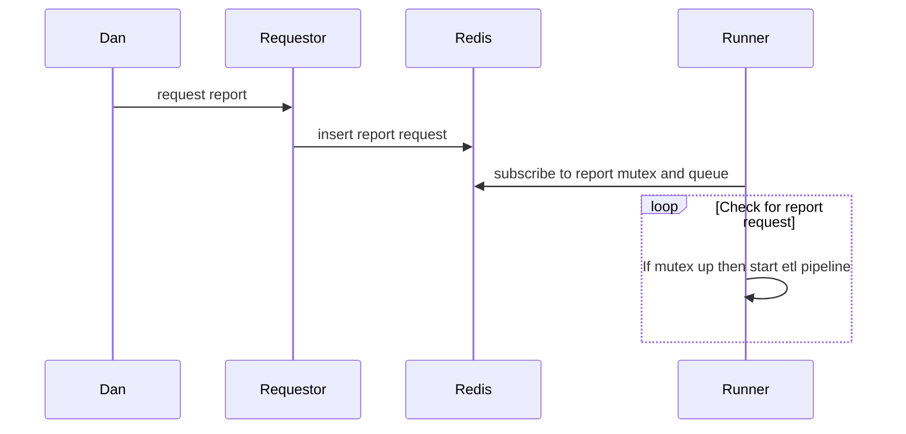
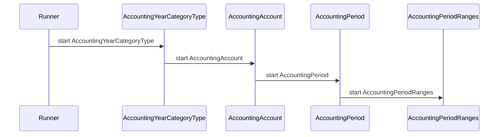
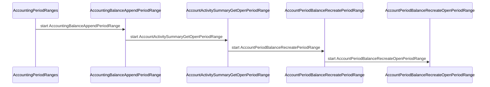

# Trial Balance Pipeline

## references

https://mermaid.js.org/intro/syntax-reference.html
https://mermaid.js.org/syntax/gantt.html


## ETL pipeline



## continuation



## Trial Balance Runner

The ETL pipeline is a set of Go routines (threads) each of which is responsible for 1 ETL script. The TB runner's main thread begins the ETL pipeline by sending a message the first ETL script go routine.  Each ETL script go routine completes and then calls the next ETL script's go routine.  The final ETL script finishes and then sets the TB mutex up so that the runner's main thread can start the pipeline again.

```psuedo_code
create go routines (threads) and communitcation channels for each tb etl script in tb etl pipeline
subscribe to redis tb mutex and request queue 

infinite while loop
    if tb queue not empty
        remove request from queue
        when tb mutex up
            down tb mutex 
            send request to 1st ETL script's go routine
        end
    end
```

## Trial Balance ETL script go routine

Each ETL script's go routine either waits for a message from the runner's main thread in the case of the first ETL script's go routine or the previous ETL scripts go routine before it starts. If it completes successfully it sends a message to the next ETL script's go routine or in the case of the final ETL script's go routine inserts a record in the redis result list indicating it's completion status.

```psuedo_code
infinite while loop
    if redis 
    runner's main thread calls 1st ETL scripts go routine.
    while more ETL scripts to run
        if ETL script complete successfully
            call the next ETL script's go routine
        else
            update redis result list to failed
            send error message via email
        end
    end
    last ETL script's go routine sets redis TB mutex up and inserts a record in the redis TB result list indicating it's completion status.
end
```

## Setup development system

### Add names of k8s services and pods to hosts file

```bash
sudo nvim /etc/hosts
127.0.0.1 redis-sentinel-master.redis-sentinel.svc.cluster.local
```

use same selector as svc/redis-sentinel-master -n redis-sentinel

### setup k8s port-forwarding with kubectl for services app needs

```bash
# To get your password run:
export REDIS_PASSWORD=$(kubectl get secret --namespace redis-sentinel redis-sentinel -o jsonpath="{.data.redis-password}" | base64 -d)

# https://kubernetes.io/docs/tasks/access-application-cluster/port-forward-access-application-cluster/
kubectl port-forward --namespace redis-sentinel svc/redis-sentinel-master 6379:6379 

REDISCLI_AUTH="$REDIS_PASSWORD" redis-cli -h redis-sentinel-master.redis-sentinel.svc.cluster.local -p 6379

# or 
REDISCLI_AUTH="$REDIS_PASSWORD" redis-cli -h 127.0.0.1 -p 6379

```

## use k8s go client

For secrets use the go client for development but should work for production also.

<https://github.com/kubernetes/client-go/blob/master/examples/out-of-cluster-client-configuration/README.md>

## Creating the project

```bash
pushd .
mkdir -p ~/src/repsys/volumes/go/trial_balance_pipeline/rs_tb_pl
cd ~/src/repsys/volumes/go/trial_balance_pipeline/rs_tb_pl
go mod init rs_tb_pl
pushd .
cd ~/src/repsys
go work use ./volumes/go/trial_balance_pipeline/rs_tb_pl
dirs -v
pushd +X # where X is 0 based number from the bottom of dirs -v entries
go get github.com/redis/go-redis/v9
go: added github.com/cespare/xxhash/v2 v2.2.0
go: added github.com/dgryski/go-rendezvous v0.0.0-20200823014737-9f7001d12a5f
go: added github.com/redis/go-redis/v9 v9.5.1

```

## get secret in cluster

<https://github.com/kubernetes/client-go>
<https://github.com/kubernetes/client-go/tree/master/examples/in-cluster-client-configuration>
<https://github.com/kubernetes/client-go/blob/master/examples/in-cluster-client-configuration/main.go>
