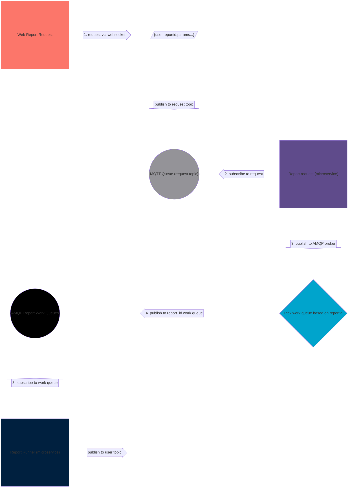

# Sequence and Block diagram

**[Development Menu](./menu.md)**\
**[Current Status](../status/weekly/current_status.md)**\
**[Back to Main](../../README.md)**

## reference

- **[block](https://mermaid.js.org/syntax/block.html)**

## Block Diagram



<!-- ## simple block

```mermaid
block-beta
  columns 5
  a1["Web Report Request"] a2<["1. request via websocket"]>(right) a3[/"{user,reportid,params...}"/]space:1 a5[("Data Warehouse")]
  b1<["7. status"]>(up) space:1 b3<["publish to request topic"]>(down) space:1 b5<["4. result"]>(up)
  space:1 c2<["7. status"]>(left) c3(("MQTT Queue (request topic)")) c4<["6. status / 3. request"]>(x) c5["ETL Runner"]
  space:4 b6<["5. source"]>(down)
  space:4 c6["Data Source"]
 
  classDef cloud fill:#696,stroke:#333;
  classDef onprem fill:#969,stroke:#333;
  class a1,c3,a5  cloud
  class c5,c6 onprem
``` -->

## Sequence Diagram

```mermaid
sequenceDiagram
    participant requester as Report Request
    participant identity as Identity Provider
    participant queue as Message Queue
    participant runner as Report Runner

    participant mail as Mail Service
    participant dw as Data Warehouse

    Note over requester,runner: The user must be authenticate to submit report requests
    requester->>+identity: Logs in using credentials

    alt Invalid Credentials
        identity->>requester: Invalid credentials
    else Valid Credentials
        identity->>-requester: Successfully logged in

        Note over requester,runner: When the user is authenticated, they can now submit report requests
        requester->>+queue: Submit new report request
        queue->>runner: Inform report runner
        runner->>dw: Store Report
        par Notifications
            runner->>mail: Email excel
        and Response
            queue-->>-requester: Report Status
        end

    end

```
