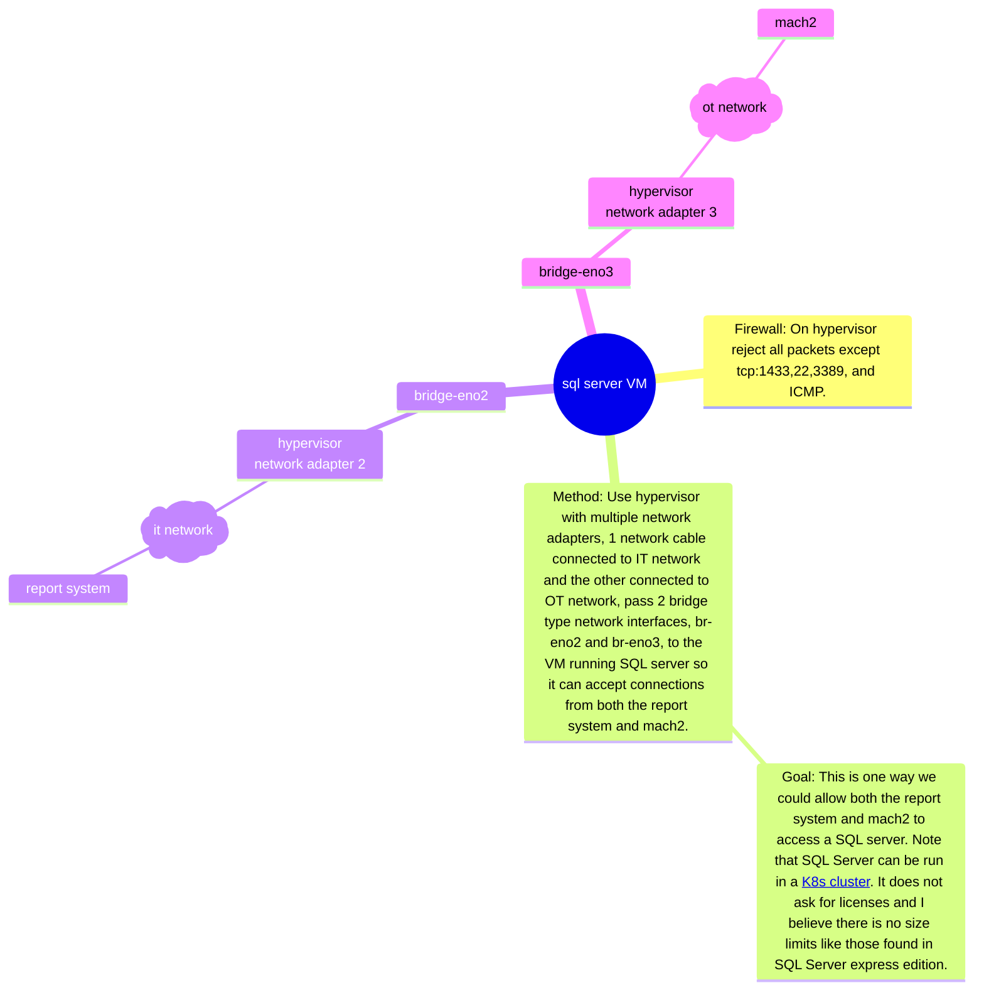

# SQL Server access to both the Report System and Mach2

**[Development Menu](./menu.md)**\
**[Current Status](../status/weekly/current_status.md)**\
**[Back to Main](../../README.md)**

```mermaid
mindmap
  root((sql server VM))
    Firewall: On hypervisor reject all packets except tcp:1433,22,3389, and ICMP.
    Method: Use hypervisor with multiple network adapters, 1 network cable connected to IT network and the other connected to OT network, pass 2 bridge type network interfaces, br-eno2 and br-eno3, to the VM running SQL server so it can accept connections from both the report system and mach2.
      Goal: This is one way we could allow both the report system and mach2 to access a SQL server. Note that SQL Server can be run in a <a href="https://github.com/microsoft/sqlworkshops-sql2019workshop/blob/master/sql2019workshop/07_SQLOnKubernetes.md">K8s cluster</a>. It does not ask for licenses and I believe there is no size limits like those found in SQL Server express edition<l>.
    bridge-eno2
      hypervisor<br/>network adapter 2<br/eno2>
        id)it network(
          report system
    bridge-eno3
      hypervisor<br/>network adapter 3<br/eno2>
        id)ot network(
          mach2

```
