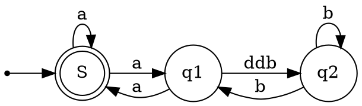

# Status

**[All Status](../weekly/status_list.md)**\
**[Back to Main](../../../README.md)**

## **[Plex ODBC](https://www.progress.com/odbc/custom-connector-sdk)**

Plex has created a Progress DataDirect ODBC driver currently we use this driver in our ETL scripts but we maybe able to use this driver in Power BI reports. If you look in our ODBC init files you will see the following 2 properties:

```bash
authmethod=iam;accesstoken=Dont_show_ourOurAccessToken;
```

## **[Access Token](https://docs.progress.com/bundle/datadirect-aha-odbc-80/page/Access-Token.html)**

Specifies the access token used to authenticate to Aha! with OAuth 2.0 enabled. Typically, this option is configured by the application; however, in some scenarios, you may need to secure a token using external processes. In those instances, you can also use this option to set the access token manually.

## **[Aha! Oauth2](https://www.aha.io/api/oauth2)**

## Plex IP restriction

- Is this similiar to Azure SQL IP restrictions.

## Updated R620s from ubuntu 22.04 desktop to 24.04 server

Using a lightweight command line hypervisor Multipass which Canonical makes.

- Did this to test netplan 1.0. It is more integrated with NetworkManagager.
- **[Install Microk8s on Multipass VM](https://microk8s.io/docs/install-multipass)**\
```multipass launch --network br0 --name microk8s-vm --mem 4G --disk 40G```

## Test Linamar Mach2 PKI

PKCS#10. PKCS#10 is a standard format for requesting X.509 certificates from the certification authorities.

PKCS#7 or P7B extension means one or more Base64 ASCII certificates stored in a . p7b or . p7c file (container). The P7B file contains the certificate and its chain (intermediate certificates) but does not contain the private key. P7B files are most commonly used on the Java Tomcat platform

X.509 is a standard format for public key certificates, digital documents that securely associate cryptographic key pairs with identities such as websites, individuals, or organizations.

### **[Validate Root Certificate](https://crt.sh/lintcert)**

Mobex PKI

```bash
-----BEGIN CERTIFICATE-----
MIIFozCCA4ugAwIBAgIUO0s2y7X7JDUBGzpuyhVGzUvc/lwwDQYJKoZIhvcNAQEL
BQAwWTELMAkGA1UEBhMCVVMxEDAOBgNVBAgMB0luZGlhbmExDzANBgNVBAcMBkFs
YmlvbjEVMBMGA1UECgwMTW9iZXggR2xvYmFsMRAwDgYDVQQDDAdSb290IENBMB4X
DTIzMDgxODIzNDI1NVoXDTQzMDgxMzIzNDI1NVowWTELMAkGA1UEBhMCVVMxEDAO
BgNVBAgMB0luZGlhbmExDzANBgNVBAcMBkFsYmlvbjEVMBMGA1UECgwMTW9iZXgg
R2xvYmFsMRAwDgYDVQQDDAdSb290IENBMIICIjANBgkqhkiG9w0BAQEFAAOCAg8A
MIICCgKCAgEA4RlvhbKk2o/JpErM0XWQlOah33HUFZT85fSMGqyMNvTmAF2Iv05P
UFNgMlWIlHRDCaa1aAgZbqnDW8A5Un3SebwX03yuTVCIqOcwOw+WS1Nd5zJXCibR
vJYUX3/LNlEaODfaGBBT/w8CafZYo78NiYHKZAR15/snicKQq7t3HBX6LEbuNWVm
Mpv4WASPOtDfUOzH83ZSHtgFMvW0PL4FGUJovqWMwVyUq7OepW5iiRRKtlaKH9BX
4NLUzr3bNaGQf+ev6giHpQjPLAAJTUpqYFT33Q3w1XFJs5fGYApTQnNyByBodvde
xaHAE63XKcCsRKP36xwkr64gCDE9qiCUTmm5tjn9hV+8bZlK5df6UVdy4eheUUUL
81aTm70CX/yqx3cc9/YoWyI2F5jAsf0Pr3o3TSHSOAGapQHQeNZLqHeU3BSuayzY
2rHIAIIAFAo4orfhHqciYP0pbKFuSaGTmh3ZTPhY6Q7ArzAurPm9UGkHaPij7FlU
bORjzrG3H9pxTZTv3mOP2DuTveN28shdZrJwB7NLzjp8SSzVDj1K9XStkGp7Ktl6
+KToah7V0Kp0KbrKOdO35HeZKs2P+wbfE6cmTnFXzdU77J1su3HViV+bG4ORdIpL
EdQNVOL9aD6MHkAxu0lwoMLKKGex29BJ+MQFB3v20sqkf/IpZ+L8P38CAwEAAaNj
MGEwHQYDVR0OBBYEFD4/yqYPDAk00sj19I8Aftb49FktMB8GA1UdIwQYMBaAFD4/
yqYPDAk00sj19I8Aftb49FktMA8GA1UdEwEB/wQFMAMBAf8wDgYDVR0PAQH/BAQD
AgGGMA0GCSqGSIb3DQEBCwUAA4ICAQA3w+7tfJNaG0ok2611H7GGmWiih96XodEl
w5Lytprh57MysTq/nrIUOf9Wo2DkLBHa4HHO1v9VQQBE5K8712JMPzL8eHDPeUpQ
Q49k1We+pUQP/1/W7K5UtNBdfPlNrwMOTnB5JpZOJxgRv9eq7U5KtzqcgT86+hDv
iwwe0OAwWhSv3mLxQwAuSXQ5K/YeYGbu7V/u/pCdGeMfqVT0/8g+kDAXAAmGj48O
eL+7kiTQobR+bfzYAiFSBWwibElvoxkOZj3vuDE3DBHGp6Abhfv09uhPf7g7/zCU
qfYPXtTWLtPk5TePPmYe275q34HU8s9s5iBzXwHUXYtypTUFsDAlbn56PBxySvF8
i0KG4/eCuUXhU9S3IKn9RZZyOJRb/Gekgj5oW7FX0GygKZH0nCTFmRBOFi+5T+oo
HcU6/6B1s1OF/28G6uVKzIgtSqrlIQegwVRpCggrHjJLRdaYEnrNX99/+zUqXyCy
QNjxzyReElKNuYY48Bnm3UiO9L2QsTLly91eg8nyJpCh0PyNosRn7TfI9oRTwxd5
zoctX0bv1onfc5Wg1SQP4u4QRxc+0Cjc8+6TpyCe3b9vvo3TuoP0IX1FEbNKEKle
6vrWEj9+AYusJqwR7nk2oF/jZa41GkxPUzURBSMnWSV5Ns+zRwI+lSXviRZucW1C
CQ/XLWsgfg==
-----END CERTIFICATE-----
```

Results:

```bash
cablint INFO CA certificate identified
x509lint INFO Checking as root CA certificate
```

Linamar PKI

Name: KORS43-CertChain-certnew.p7b

```bash
-----BEGIN CERTIFICATE-----
MIIQXgYJKoZIhvcNAQcCoIIQTzCCEEsCAQExADCCBcUGCSqGSIb3DQEHAaCCBbYE
ggWyMIIFrjCCBJagAwIBAgITNQAF06i16tqDxSKu7AADAAXTqDANBgkqhkiG9w0B
AQsFADBGMRMwEQYKCZImiZPyLGQBGRYDY29tMRcwFQYKCZImiZPyLGQBGRYHbGlu
YW1hcjEWMBQGA1UEAxMNbGluYW1hci1hZGNhMTAeFw0yNDA2MTExOTE5NDlaFw0y
NjA2MTExOTE5NDlaMA0xCzAJBgNVBAYTAlVTMIIBIjANBgkqhkiG9w0BAQEFAAOC
AQ8AMIIBCgKCAQEAjQHCmtTVXl6qs6Zera8EflD7i2k72LVU6FrphmTgsk3Ixpcf
N0V0+q9FXnLxmBcvVYVjF1lta4NFPDuh7prxpiHtfTBMDKo0Zysvb8W/cbBX5xMZ
5CBDp+3LTr7UTcOtTISUyWoQwuCAScYM5ip4PJ10hwZxUZJqFTLNmUw50CluCjMR
2mhqETCvyjGAERGSfFyB+/4oS3KFB/DT9nED3mK8aeM6CJnKyFzvtxkHxqWpKING
ZZwfBE4O5UOm65UycCPoe9DgXft1/OcCxQOWTqs0Opla07etsfHm/94QgrQB3DMn
M8S4rSOr+SBLfFwBI8GQBSJ+d9tKEo8qdvkxtQIDAQABo4ICzDCCAsgwHQYDVR0O
BBYEFEi+e9ooB2mCTXKZFuwKCdhC8BFJMB8GA1UdIwQYMBaAFOhKBv9Z5NaTVA2U
vWqpnhmSUkCqMIIBFgYDVR0fBIIBDTCCAQkwggEFoIIBAaCB/oaBu2xkYXA6Ly8v
Q049bGluYW1hci1hZGNhMSgxKSxDTj1QRC1DTy1WQ0EyMixDTj1DRFAsQ049UHVi
bGljJTIwS2V5JTIwU2VydmljZXMsQ049U2VydmljZXMsQ049Q29uZmlndXJhdGlv
bixEQz1saW5hbWFyLERDPWNvbT9jZXJ0aWZpY2F0ZVJldm9jYXRpb25MaXN0P2Jh
c2U/b2JqZWN0Q2xhc3M9Y1JMRGlzdHJpYnV0aW9uUG9pbnSGPmh0dHA6Ly9QRC1D
Ty1WQ0EyMi5saW5hbWFyLmNvbS9DZXJ0RW5yb2xsL2xpbmFtYXItYWRjYTEoMSku
Y3JsMIIBJQYIKwYBBQUHAQEEggEXMIIBEzCBrAYIKwYBBQUHMAKGgZ9sZGFwOi8v
L0NOPWxpbmFtYXItYWRjYTEsQ049QUlBLENOPVB1YmxpYyUyMEtleSUyMFNlcnZp
Y2VzLENOPVNlcnZpY2VzLENOPUNvbmZpZ3VyYXRpb24sREM9bGluYW1hcixEQz1j
b20/Y0FDZXJ0aWZpY2F0ZT9iYXNlP29iamVjdENsYXNzPWNlcnRpZmljYXRpb25B
dXRob3JpdHkwYgYIKwYBBQUHMAKGVmh0dHA6Ly9QRC1DTy1WQ0EyMi5saW5hbWFy
LmNvbS9DZXJ0RW5yb2xsL1BELUNPLVZDQTIyLmxpbmFtYXIuY29tX2xpbmFtYXIt
YWRjYTEoMykuY3J0MCEGCSsGAQQBgjcUAgQUHhIAVwBlAGIAUwBlAHIAdgBlAHIw
CwYDVR0PBAQDAgWgMBMGA1UdJQQMMAoGCCsGAQUFBwMBMA0GCSqGSIb3DQEBCwUA
A4IBAQAYPM1BDk041ZlwNIgN4UvXQksI4yAkCrkQf5jNZFAKT+Pd2IBD9U3czFak
sOVfinS4qQ12GWDlt/VWZMgP/1UU7Z644WH0mU8eTFkiVMK2ysVwoHWUu2JWw1+T
jpaIbm0hJcRFwi5DiLdMmp4YkZlSyKkR56aFrX0zgMwq3JBn6Z1X7xyyNTB2jgdV
vxneV74pTTNUddbJyUNKbdHuJwWFuNhBxEdg0xgtT0OFoMoJKKNwY797ReLOItqc
//kNu+xZYNRUPJbkimvIIY02WClzdciREpBuz4uFBZHaoyB/h73MAbmZxW91PuLw
A3K3hecckF6Ok5tU4FGBfHK5MeiroIIKdzCCBa4wggSWoAMCAQICEzUABdOotera
g8UiruwAAwAF06gwDQYJKoZIhvcNAQELBQAwRjETMBEGCgmSJomT8ixkARkWA2Nv
bTEXMBUGCgmSJomT8ixkARkWB2xpbmFtYXIxFjAUBgNVBAMTDWxpbmFtYXItYWRj
YTEwHhcNMjQwNjExMTkxOTQ5WhcNMjYwNjExMTkxOTQ5WjANMQswCQYDVQQGEwJV
UzCCASIwDQYJKoZIhvcNAQEBBQADggEPADCCAQoCggEBAI0BwprU1V5eqrOmXq2v
BH5Q+4tpO9i1VOha6YZk4LJNyMaXHzdFdPqvRV5y8ZgXL1WFYxdZbWuDRTw7oe6a
8aYh7X0wTAyqNGcrL2/Fv3GwV+cTGeQgQ6fty06+1E3DrUyElMlqEMLggEnGDOYq
eDyddIcGcVGSahUyzZlMOdApbgozEdpoahEwr8oxgBERknxcgfv+KEtyhQfw0/Zx
A95ivGnjOgiZyshc77cZB8alqSiDRmWcHwRODuVDpuuVMnAj6HvQ4F37dfznAsUD
lk6rNDqZWtO3rbHx5v/eEIK0AdwzJzPEuK0jq/kgS3xcASPBkAUifnfbShKPKnb5
MbUCAwEAAaOCAswwggLIMB0GA1UdDgQWBBRIvnvaKAdpgk1ymRbsCgnYQvARSTAf
BgNVHSMEGDAWgBToSgb/WeTWk1QNlL1qqZ4ZklJAqjCCARYGA1UdHwSCAQ0wggEJ
MIIBBaCCAQGggf6GgbtsZGFwOi8vL0NOPWxpbmFtYXItYWRjYTEoMSksQ049UEQt
Q08tVkNBMjIsQ049Q0RQLENOPVB1YmxpYyUyMEtleSUyMFNlcnZpY2VzLENOPVNl
cnZpY2VzLENOPUNvbmZpZ3VyYXRpb24sREM9bGluYW1hcixEQz1jb20/Y2VydGlm
aWNhdGVSZXZvY2F0aW9uTGlzdD9iYXNlP29iamVjdENsYXNzPWNSTERpc3RyaWJ1
dGlvblBvaW50hj5odHRwOi8vUEQtQ08tVkNBMjIubGluYW1hci5jb20vQ2VydEVu
cm9sbC9saW5hbWFyLWFkY2ExKDEpLmNybDCCASUGCCsGAQUFBwEBBIIBFzCCARMw
gawGCCsGAQUFBzAChoGfbGRhcDovLy9DTj1saW5hbWFyLWFkY2ExLENOPUFJQSxD
Tj1QdWJsaWMlMjBLZXklMjBTZXJ2aWNlcyxDTj1TZXJ2aWNlcyxDTj1Db25maWd1
cmF0aW9uLERDPWxpbmFtYXIsREM9Y29tP2NBQ2VydGlmaWNhdGU/YmFzZT9vYmpl
Y3RDbGFzcz1jZXJ0aWZpY2F0aW9uQXV0aG9yaXR5MGIGCCsGAQUFBzAChlZodHRw
Oi8vUEQtQ08tVkNBMjIubGluYW1hci5jb20vQ2VydEVucm9sbC9QRC1DTy1WQ0Ey
Mi5saW5hbWFyLmNvbV9saW5hbWFyLWFkY2ExKDMpLmNydDAhBgkrBgEEAYI3FAIE
FB4SAFcAZQBiAFMAZQByAHYAZQByMAsGA1UdDwQEAwIFoDATBgNVHSUEDDAKBggr
BgEFBQcDATANBgkqhkiG9w0BAQsFAAOCAQEAGDzNQQ5NONWZcDSIDeFL10JLCOMg
JAq5EH+YzWRQCk/j3diAQ/VN3MxWpLDlX4p0uKkNdhlg5bf1VmTID/9VFO2euOFh
9JlPHkxZIlTCtsrFcKB1lLtiVsNfk46WiG5tISXERcIuQ4i3TJqeGJGZUsipEeem
ha19M4DMKtyQZ+mdV+8csjUwdo4HVb8Z3le+KU0zVHXWyclDSm3R7icFhbjYQcRH
YNMYLU9DhaDKCSijcGO/e0XiziLanP/5DbvsWWDUVDyW5IpryCGNNlgpc3XIkRKQ
bs+LhQWR2qMgf4e9zAG5mcVvdT7i8ANyt4XnHJBejpObVOBRgXxyuTHoqzCCBMEw
ggOpoAMCAQICEB0v5FRynqOzRnCCt2XnNd4wDQYJKoZIhvcNAQELBQAwRjETMBEG
CgmSJomT8ixkARkWA2NvbTEXMBUGCgmSJomT8ixkARkWB2xpbmFtYXIxFjAUBgNV
BAMTDWxpbmFtYXItYWRjYTEwHhcNMTEwMTI1MTg0MTQ4WhcNMzAwMzE3MTMxNTI1
WjBGMRMwEQYKCZImiZPyLGQBGRYDY29tMRcwFQYKCZImiZPyLGQBGRYHbGluYW1h
cjEWMBQGA1UEAxMNbGluYW1hci1hZGNhMTCCASIwDQYJKoZIhvcNAQEBBQADggEP
ADCCAQoCggEBAMWH9lBtDKbcURj7gHQTQIviY1zTSU2sT4JOcRASI1jdylWCVpTQ
XaZ0w11HPBGhlNKWYtlCoXRp4d8KfVDUGHKEGjb3lqIoWIKz6H1P0O/0LUUiNCY1
YGOxVqLaark9Qrz/ta2dmZRHr8sWmmu+OFx8XVOE63tobzZPyjKgYFdjfxgPorCb
+pPFfmyO0dLfl4GnpuRLUj2uSCIdRhcKvKd4QAcEodGzskEvBQnEimD848m9bwiB
/CzTufDhNHZ2BqygK94OyBX8+smDUsnO7zFUsIz9SXPTIHFvBqTqvx1GvFRnSA7r
rRQAMWZM110IZVNSBEy5lLX0m2U2x+qdbLUCAwEAAaOCAakwggGlMBMGCSsGAQQB
gjcUAgQGHgQAQwBBMAsGA1UdDwQEAwIBRjAPBgNVHRMBAf8EBTADAQH/MB0GA1Ud
DgQWBBToSgb/WeTWk1QNlL1qqZ4ZklJAqjCCARYGA1UdHwSCAQ0wggEJMIIBBaCC
AQGggf6GgbtsZGFwOi8vL0NOPWxpbmFtYXItYWRjYTEoMSksQ049bGluYW1hci1k
YzgsQ049Q0RQLENOPVB1YmxpYyUyMEtleSUyMFNlcnZpY2VzLENOPVNlcnZpY2Vz
LENOPUNvbmZpZ3VyYXRpb24sREM9bGluYW1hcixEQz1jb20/Y2VydGlmaWNhdGVS
ZXZvY2F0aW9uTGlzdD9iYXNlP29iamVjdENsYXNzPWNSTERpc3RyaWJ1dGlvblBv
aW50hj5odHRwOi8vbGluYW1hci1kYzgubGluYW1hci5jb20vQ2VydEVucm9sbC9s
aW5hbWFyLWFkY2ExKDEpLmNybDASBgkrBgEEAYI3FQEEBQIDAQADMCMGCSsGAQQB
gjcVAgQWBBS5D7MdO6UHWjUntymIEcex0XxmTDANBgkqhkiG9w0BAQsFAAOCAQEA
fKnyKi6pkOKgBcbfWcCwIgu+TNHcCuCVeY5dcDFiMpJ3gMRsM1V2pCWRqrFHpo9P
Ntpfo+pXNhE//Qgp5ZI71iTe4r7bdHbTbiI4mvd6bQM8ZHUOif72ngwkRvGxkVP9
cO0WNn+27YWwZbq0mjV5MVyukA/43yLPAgnNG87zQ1i/PByr0hR6E5kwDO4TiBVd
hZDKpblf1GB+C8OMHbeZPg+5Inejj5LYBmK+UBpPeEjf3Ckriq19YMOVK5X/+hke
BMoXCT+KUyp4A95WFAuGE/7tt0/0T9f/3zYyzFd9dud8fbq1KeUYAypf1od1oANa
/OL6M3EBYMrAmS6n4wzPbTEA
-----END CERTIFICATE-----
```

cablint FATAL ASN.1 Error in Certificate: BER decoding failed at octet 4: Parse error
cablint WARNING Cowardly refusing to run CAB check due to previous errors
x509lint ERROR Error parsing certificate
zlint FATAL asn1: structure error: tags don't match (16 vs {class:0 tag:6 length:9 isCompound:false}) {optional:false explicit:false application:false private:false defaultValue:<nil> tag:<nil> stringType:0 timeType:0 set:false omitEmpty:false} tbsCertificate @2

### **[Validate Intermediat Certificate](https://crt.sh/lintcert)**

Mobex PKI

```bash
-----BEGIN CERTIFICATE-----
MIIGZzCCBE+gAwIBAgIUV0VvGglWqwxjAcerk/wikYujtAYwDQYJKoZIhvcNAQEL
BQAwWTELMAkGA1UEBhMCVVMxEDAOBgNVBAgMB0luZGlhbmExDzANBgNVBAcMBkFs
YmlvbjEVMBMGA1UECgwMTW9iZXggR2xvYmFsMRAwDgYDVQQDDAdSb290IENBMB4X
DTIzMDgxODIzNTcyMFoXDTMzMDgxNTIzNTcyMFowUDELMAkGA1UEBhMCVVMxEDAO
BgNVBAgMB0luZGlhbmExFTATBgNVBAoMDE1vYmV4IEdsb2JhbDEYMBYGA1UEAwwP
SW50ZXJtZWRpYXRlIENBMIICIjANBgkqhkiG9w0BAQEFAAOCAg8AMIICCgKCAgEA
1NGcuAahxt+LSLoJgrWrANLz0yqLu/gvoQBppEX0APkIr7crGCfqlXiMHGbxAmdJ
7D22XmXFtBh3toJmhXgbh5YFYzhJPSiGBkLkZ6Q2q3ZFvd863gAFuG+YOPYorPSx
RJTjQPt1IoX3qFBRxrG/VLo4TfCjiqRlaUaZiNIg5tPXIz+GnqctGfsnXGggShf1
9Uf6DvXVO0TjrWh7dv5Zc9IwheWwGGNiWKfN4QJZP31UFcIeq0zV1AF+7zUxQ7+2
dfa8Py+88muYqiqO+l/iH5v6MzxMOhayhRouBD8ONA2+SD4rIqMOJEHk/fzmlrDz
UOrdB1Fr+/rHy82/DDC+PaPBEtEVVWyeTwIK1ARQQEtPzSf7ZpPFIoYIImpDSazu
OBi1gohBS9v7mwcoG+UBH+hj4Cc03XhPKVdKsKbrtoJAHmJIiAhqArelZD68pIOa
jrkgYJ1DpNXgz0CMbVRRAgmslj9GrSXn4BDmdrjq/CHHVL0uh9OdNpSBxv7EFty7
24hM4l2DV9T2RYcgnjLZNhZYVQFdQf7BBPS1g0qF01huv8ymj9JFYUSkgBHlNxR8
UiaM1UfevAe9VmQMJHpGxEvSY0cIqrAmdqHMjKBNRMq1o6tJGhktUvEuTsfzcFuO
zTfD0v5OTZNtO8e9IY1NJgxNwBwAooiNBCqGQOdad7sCAwEAAaOCAS4wggEqMB0G
A1UdDgQWBBSyBHshWonq/j+R8pfSRj1CqqpgZjAfBgNVHSMEGDAWgBQ+P8qmDwwJ
NNLI9fSPAH7W+PRZLTASBgNVHRMBAf8ECDAGAQH/AgEAMA4GA1UdDwEB/wQEAwIB
hjAbBgNVHSAEFDASMAgGBmeBDAECATAGBgRVHSAAMC4GA1UdHwQnMCUwI6AhoB+G
HWh0dHA6Ly9idXNjaGUtY25jLmNvbS9jcmwucGVtMBMGA1UdJQQMMAoGCCsGAQUF
BwMBMGIGCCsGAQUFBwEBBFYwVDAnBggrBgEFBQcwAYYbaHR0cDovL29jc3AuYnVz
Y2hlLWNuYy5jb20vMCkGCCsGAQUFBzAChh1odHRwOi8vYnVzY2hlLWNuYy5jb20v
Y2EuaHRtbDANBgkqhkiG9w0BAQsFAAOCAgEAFA8lK4wMEkjE7YZBLO7ozdrO4/Lx
GeN8IR3HoLbf16CX0wU0G1ovvUWZdXn0IDG6b95at0g5mojPSxoVDb8AesQhyilN
B4/14g2nQmUJlA7IZq4sImfkeBnGyzxinz0EgjcyDfeRzoPlLndqW3/cfdp7F02E
YZNHpDw+ICRsfu70ZqKmaMI0dyz7d0T1/NSUUjiH07rEg1PC5v6o+JowG2sNUwdu
zOB7ABa6oj44Zju+1Kr+N9KWQrnl2z6kDo8I1K63uIW7TO7M8ggkNkhUAi2xOPby
fMYnAa8qtE9BLTf96prjrC94ePDsyY93OOIShuvUTpo0XEg/91VpSfErz7piTKu0
J74KvxRC2+/9QYP0u+IG4swYYBsrxJd8tOFTP3aJ78AggYuvDFzgRUugiKhE4cpg
c41E2r+NdjOj5NNcojIQ5MVlB7yF0v+Dh3q1u0NGimoJCbPsUb9lx3nxesXGe8bj
1uuMY7k2iiNHX9qjPTMtBMepQE8KIiUlEz6oobDXlIDFd4jJ5Cixz0diPCjOSh6Q
n48HlWqGxwa5pmS1doWjLLvikyGQz2KexmZ2/RYds5Fqnf12vr4CDY6MRW1fJoPW
ELXD3+rXuAEzGIbIAmyX9ePE66rcpBTcHEEucyYCfgfd+W0hDvwI6IZcNqnMM/ZN
qLRk/kaHCOL1tEE=
-----END CERTIFICATE-----
```

Results:

```bash
cablint INFO CA certificate identified
x509lint INFO Checking as intermediate CA certificate
```

### Linamar Intermediate Certificate

No intermediate certificate.

### **[Validate Server SAN Certificate](https://crt.sh/lintcert)**

```bash
-----BEGIN CERTIFICATE-----
MIIFCDCCAvCgAwIBAgIUUNQ5b+Tmi/3/JbtYSdpDa6KdTiYwDQYJKoZIhvcNAQEL
BQAwUDELMAkGA1UEBhMCVVMxEDAOBgNVBAgMB0luZGlhbmExFTATBgNVBAoMDE1v
YmV4IEdsb2JhbDEYMBYGA1UEAwwPSW50ZXJtZWRpYXRlIENBMB4XDTIzMDgyMjE4
MTMzN1oXDTI0MDgyMTE4MTMzN1owDTELMAkGA1UEBhMCVVMwggEiMA0GCSqGSIb3
DQEBAQUAA4IBDwAwggEKAoIBAQDe70Zgy+Xz+RVVnc4XQ8iYyyBsoTGzAf5FBe87
idI8HVhSHyBJvMWEeRj2uvL2ZX6vLf+wZySiw12gcagtpExtq2AqlPLu5dPPM60a
OYPJ/PD0WB1Sw5OP7zXiIU0pVaee61Ovt0efTtmv00rP3DbB5glblMr1u/7EvxEK
M8DZekfITrcqjrnhSZkzW+U/AYlb8jGjmGGU3oKgUaWcLUGZ7XYotkDCfqsipLPd
tQNJcQT13Pmt4P+VcwZaif7OvOYKiRulRp5xrrXqb99B3nxYVrScWVokBWlxha9k
vDG/edH2t+bgZOQh9e12KQ9VVEdbkq5Gq6GW0ISeI8LvUONlAgMBAAGjggEbMIIB
FzAJBgNVHRMEAjAAMB0GA1UdDgQWBBQEH23aVZ1mv1zjKFNsWBCrxLXn+TAfBgNV
HSMEGDAWgBSyBHshWonq/j+R8pfSRj1CqqpgZjAOBgNVHQ8BAf8EBAMCBaAwEwYD
VR0lBAwwCgYIKwYBBQUHAwEwJAYDVR0RBB0wG4IZZnJ0LWtvcnM0My5idXNjaGUt
Y25jLmNvbTBiBggrBgEFBQcBAQRWMFQwJwYIKwYBBQUHMAGGG2h0dHA6Ly9vY3Nw
LmJ1c2NoZS1jbmMuY29tLzApBggrBgEFBQcwAoYdaHR0cDovL2J1c2NoZS1jbmMu
Y29tL2NhLmh0bWwwGwYDVR0gBBQwEjAIBgZngQwBAgEwBgYEVR0gADANBgkqhkiG
9w0BAQsFAAOCAgEA0ST58URKcVnUJ2QUod05sCWfaUvqgFMbQqqJHmKp6SgsQesx
doQboWMh2fFfKMlEcusHAAKrMTN6bdMyQLrojbThzZs+sVsP/QQHJDWxV6teM5by
/+q+/C1+IXDT93nhTBGJ4gy0kVzazSQnYD11jL4npQTVXaHNwnvqWIdH+ish2reQ
m/EKQfNVCFXLoxp8+WoSSpAHPqiI8+Q7/76L8Yc4VhfLeCpnUAKfrtzKjfwJ6EXN
9lbE6O3FAf2xB2c6tQDLPQHgi8qOWFVLOwkrYYRYmtpI9jr0ZS5MlIGiRbDBRwA/
K4+JD+oAZXpcnPHTV/9Ci6VZ2Vq2tHU0+oJcSEVo1HiJTCcR+upf/Ej+hnUWBOE7
dDfQo51X/O+n7mGDhZnmWSH/m39B4mjzF3laWx9XSyjlQBlQT0Qk7zf4EnN5kcS8
iJap0Hd2zR4mqV+Sdfiq9BpaRpRtgkF5zcqDlXwoL410rGC2+bX2cFGWjictsLuI
3LqANUCNEvc7f5aQxIaYeN/iKE7PpIQenHiLZQlPJq7hrIzroAygOmgTQLWqZTd6
VVrsGnlrHvTn7TSMFYK6RqREhOdUc6DBIhc0i2E1IEV4uJRZx0Bt96lKu+izAyjt
EAFvm3gv6rfwTZ4pQ/SrS+5IJNwDfrlfukUFQ/M7VuTLLj6nsluILZaiIEY=
-----END CERTIFICATE-----
```

Results:

```bash
cablint INFO TLS Server certificate identified
x509lint INFO Checking as leaf certificate
zlint NOTICE Check if certificate has enough embedded SCTs to meet Apple CT Policy
```

Linamar PKI

```bash
-----BEGIN CERTIFICATE-----
MIIFrjCCBJagAwIBAgITNQAF06i16tqDxSKu7AADAAXTqDANBgkqhkiG9w0BAQsF
ADBGMRMwEQYKCZImiZPyLGQBGRYDY29tMRcwFQYKCZImiZPyLGQBGRYHbGluYW1h
cjEWMBQGA1UEAxMNbGluYW1hci1hZGNhMTAeFw0yNDA2MTExOTE5NDlaFw0yNjA2
MTExOTE5NDlaMA0xCzAJBgNVBAYTAlVTMIIBIjANBgkqhkiG9w0BAQEFAAOCAQ8A
MIIBCgKCAQEAjQHCmtTVXl6qs6Zera8EflD7i2k72LVU6FrphmTgsk3IxpcfN0V0
+q9FXnLxmBcvVYVjF1lta4NFPDuh7prxpiHtfTBMDKo0Zysvb8W/cbBX5xMZ5CBD
p+3LTr7UTcOtTISUyWoQwuCAScYM5ip4PJ10hwZxUZJqFTLNmUw50CluCjMR2mhq
ETCvyjGAERGSfFyB+/4oS3KFB/DT9nED3mK8aeM6CJnKyFzvtxkHxqWpKINGZZwf
BE4O5UOm65UycCPoe9DgXft1/OcCxQOWTqs0Opla07etsfHm/94QgrQB3DMnM8S4
rSOr+SBLfFwBI8GQBSJ+d9tKEo8qdvkxtQIDAQABo4ICzDCCAsgwHQYDVR0OBBYE
FEi+e9ooB2mCTXKZFuwKCdhC8BFJMB8GA1UdIwQYMBaAFOhKBv9Z5NaTVA2UvWqp
nhmSUkCqMIIBFgYDVR0fBIIBDTCCAQkwggEFoIIBAaCB/oaBu2xkYXA6Ly8vQ049
bGluYW1hci1hZGNhMSgxKSxDTj1QRC1DTy1WQ0EyMixDTj1DRFAsQ049UHVibGlj
JTIwS2V5JTIwU2VydmljZXMsQ049U2VydmljZXMsQ049Q29uZmlndXJhdGlvbixE
Qz1saW5hbWFyLERDPWNvbT9jZXJ0aWZpY2F0ZVJldm9jYXRpb25MaXN0P2Jhc2U/
b2JqZWN0Q2xhc3M9Y1JMRGlzdHJpYnV0aW9uUG9pbnSGPmh0dHA6Ly9QRC1DTy1W
Q0EyMi5saW5hbWFyLmNvbS9DZXJ0RW5yb2xsL2xpbmFtYXItYWRjYTEoMSkuY3Js
MIIBJQYIKwYBBQUHAQEEggEXMIIBEzCBrAYIKwYBBQUHMAKGgZ9sZGFwOi8vL0NO
PWxpbmFtYXItYWRjYTEsQ049QUlBLENOPVB1YmxpYyUyMEtleSUyMFNlcnZpY2Vz
LENOPVNlcnZpY2VzLENOPUNvbmZpZ3VyYXRpb24sREM9bGluYW1hcixEQz1jb20/
Y0FDZXJ0aWZpY2F0ZT9iYXNlP29iamVjdENsYXNzPWNlcnRpZmljYXRpb25BdXRo
b3JpdHkwYgYIKwYBBQUHMAKGVmh0dHA6Ly9QRC1DTy1WQ0EyMi5saW5hbWFyLmNv
bS9DZXJ0RW5yb2xsL1BELUNPLVZDQTIyLmxpbmFtYXIuY29tX2xpbmFtYXItYWRj
YTEoMykuY3J0MCEGCSsGAQQBgjcUAgQUHhIAVwBlAGIAUwBlAHIAdgBlAHIwCwYD
VR0PBAQDAgWgMBMGA1UdJQQMMAoGCCsGAQUFBwMBMA0GCSqGSIb3DQEBCwUAA4IB
AQAYPM1BDk041ZlwNIgN4UvXQksI4yAkCrkQf5jNZFAKT+Pd2IBD9U3czFaksOVf
inS4qQ12GWDlt/VWZMgP/1UU7Z644WH0mU8eTFkiVMK2ysVwoHWUu2JWw1+TjpaI
bm0hJcRFwi5DiLdMmp4YkZlSyKkR56aFrX0zgMwq3JBn6Z1X7xyyNTB2jgdVvxne
V74pTTNUddbJyUNKbdHuJwWFuNhBxEdg0xgtT0OFoMoJKKNwY797ReLOItqc//kN
u+xZYNRUPJbkimvIIY02WClzdciREpBuz4uFBZHaoyB/h73MAbmZxW91PuLwA3K3
hecckF6Ok5tU4FGBfHK5Meir
-----END CERTIFICATE-----
```

Results:

```bash
cablint ERROR BR certificates must be 398 days in validity or less
cablint ERROR BR certificates must have subject alternative names extension
cablint ERROR BR certificates must include an HTTP URL of the OCSP responder
cablint ERROR BR certificates must include certificatePolicies
cablint WARNING Extension should be critical for KeyUsage
cablint WARNING Microsoft extension 1.3.6.1.4.1.311.20.2 treated as opaque extension
cablint INFO TLS Server certificate identified
x509lint ERROR Issuer without countryName
x509lint ERROR Issuer without organizationName
x509lint ERROR No OCSP over HTTP
x509lint ERROR No policy extension
x509lint ERROR No Subject alternative name extension
x509lint WARNING Key usage not critical
x509lint INFO Checking as leaf certificate
x509lint INFO Unknown validation policy
zlint ERROR Subscriber Certificate: authorityInformationAccess MUST contain the HTTP URL of the Issuing CA's OSCP responder.
zlint ERROR Subscriber Certificate: certificatePolicies MUST be present and SHOULD NOT be marked critical.
zlint ERROR Subscriber certificates must contain at least one policy identifier that indicates adherence to CAB standards
zlint ERROR Subscriber certificates MUST contain the Subject Alternate Name extension
zlint ERROR TLS server certificates issued on or after September 1, 2020 00:00 GMT/UTC must not have a validity period greater than 398 days
zlint WARNING Subscriber certificates authorityInformationAccess extension should contain the HTTP URL of the issuing CA’s certificate, for public certificates this should not be an internal name
zlint WARNING The keyUsage extension SHOULD be critical
zlint WARNING TLS server certificates issued on or after September 1, 2020 00:00 GMT/UTC should not have a validity period greater than 397 days
zlint NOTICE Check if certificate has enough embedded SCTs to meet Apple CT Policy
```

## test portforwarding on multipass test5

- **[nfttables debug](https://wiki.nftables.org/wiki-nftables/index.php/Ruleset_debug/tracing)**

## MES software

MES software monitors, tracks, documents, and controls the process of manufacturing goods from raw materials to finished products.

## So here comes MES

While SCADA is designed to control the production in real-time and ERP is designed for management of the company’s business processes, MES is designed to track and collect information about each product (semi-product) through all stages of the production process. It is a software capable of operating with big data received in real-time (PLC, SCADA), while also exchanging information with the transactional world (ERP, SCM, CRM).

MES’s purpose is to analyze and extract important information from this big data and forward it to ERP. Also, this software solution can convert work orders received from ERP to a production schedule and is capable of dispatching this schedule to the shop floor (PLC, SCADA). It is very important to properly correlate between process data and product quality and to provide and collect information in different formats from various systems.

## requirement

### Where is the data from?

- IAM/OIDC Zitadel -> Entra ID
- Web APP
- data source
  - excel
  - **[ERP/IFS](https://docs.ifs.com/techdocs/21r2/010_overview/240_integration/400_rest_apis/)**
  - from web app
- ETL scripts
- data warehouse
- Power BI report

## Cool apps

- **[No Machine RDP](https://www.nomachine.com/)**
- **[Vesktop](https://github.com/Vencord/Vesktop)**
- **[Parsec](https://parsec.app/)**

## **[Graph Visualization](https://graphviz.org/about/)**

Graph visualization is a way of representing structural information as diagrams of abstract graphs and networks. Automatic graph drawing has many important applications in software engineering, database and web design, networking, and in visual interfaces for many other domains.

Graphviz is open source graph visualization software. It has several main graph layout programs. See the Gallery for some sample layouts. It also has web and interactive graphical interfaces, and auxiliary tools, libraries, and language bindings.



## **[Modify ETL scripts to use local SQL Server container](https://github.com/microsoft/sqlworkshops-sql2019workshop/blob/master/sql2019workshop/07_SQLOnKubernetes.md)**

- Intermediate step in the report system to ensure we can always run the TB.
- The MI is backed up to a local drive and SQL server currently runs from a dockerfile.

## **[SQL Server Containers](https://learn.microsoft.com/en-us/sql/linux/sql-server-linux-docker-container-deployment?view=sql-server-ver16&pivots=cs1-bash)**

## Run production container images

The quickstart in the previous section runs the free Developer edition of SQL Server from the Microsoft Artifact Registry. Most of the information still applies if you want to run production container images, such as Enterprise, Standard, or Web editions. However, there are a few differences that are outlined here.

You can only use SQL Server in a production environment if you have a valid license. You can obtain a free SQL Server Express production license here. SQL Server Standard and Enterprise edition licenses are available through Microsoft Volume Licensing.

## Mach2 Linamar PKI

- Now #1 priority
- Ask please give notice if any plans to shutdown Azure MI in the near future.

## **[Reporting System IP Request](../../report_system/r620s.md)**

- 12 for r620s
- 4 for Albion dev system and k8s cluster
- 4 for Avilla dev system and k8s cluster

## **[IT/OT database access](../../report_system/it_ot_database.md)**

## Linamar PKI

- Lint certificate chain
- Lint kors43 SAN server certificate
- Fix any errors
- Test certificate chain
- Format kors43 certificate chain for jboss/Niagara
- Ask Sam to import certificate chain on kors43 using Niagara front-end

## **[Netfilter](../../../research/m_z/virtualization/networking/packet_classification_framework/netfilter.md)**

Netfilter is a subsystem that was introduced in the Linux 2.4 kernel that provides a framework for implementing advanced network functionalities such as packet filtering, network address translation (NAT), and connection tracking. It achieves this by leveraging hooks in the kernel’s network code, which are the locations where kernel code can register functions to be invoked for specific network events. For instance, when a packet is received, it triggers a handler for the event and performs module specified actions.

## Netfilter hooks into Linux networking packet flows

The following schematic shows packet flows through Linux networking:


## **[Network packet journey](../../../research/m_z/virtualization/networking/packet_classification_framework/network_packet_journey.md)**

- Client uses name servers to determine IP address of destination service
- Client sends network packet to IP address
- Networking devices route network packet to destination network using routing protocals such as:
  - Routing Information Protocol (RIP)
  - Interior Gateway Protocol (IGRP)
  - Open Shortest Path First (OSPF)
  - Exterior Gateway Protocol (EGP)
  - Enhanced Interior Gateway Routing Protocol (EIGRP)
  - Border Gateway Protocol (BGP)
  - Intermediate System-to-Intermediate System (IS-IS)
- Once the network packet has arrived at the destination network the network routing device uses the ARP protocol/table to determine the HW address of the network interface that is assigned to the destination IP address.
- Once the HW (MAC) address is known the network routing can also use MAC tables to determine the port of layer 2 switch in which the network interface device is attached to.
- Once the network packet arrives on the destination host's kernel via the network interface device then it's firewall determines whether to accept/reject/forward the network packet.

## **[What happens when the packet arrives at it's destination](../../../research/m_z/virtualization/networking/packet_classification_framework/iptables/iptables_netfilter_arch.md)**

In this guide, we will dive into the iptables architecture with the aim of making it more comprehensible for users who need to build their own firewall policies. We will discuss how iptables interacts with netfilter and how the various components fit together to provide a comprehensive filtering system.

## service-level agreement (SLA)

A service-level agreement (SLA) is a contract between a service provider and its customers that documents what services the provider will furnish and defines the service standards the provider is obligated to meet.

## SentinelOne, Inc

SentinelOne, Inc. is an American cybersecurity company listed on NYSE based in Mountain View, California. The company was founded in 2013 by Tomer Weingarten, Almog Cohen and Ehud Shamir. Weingarten acts as the company's CEO. Vats Srivatsan is the company's COO.

## NEXT

- **[port forwarding with nftables](https://access.redhat.com/documentation/en-us/red_hat_enterprise_linux/7/html/security_guide/sec-configuring_port_forwarding_using_nftables)**

- **[Go Backend with IAM](../../../../go_zit_backend/README.md#next)**\
Read more about how to **[generate a key file](../../../research/m_z/zitadel/key_file.md)**.

- **[Go Frontend with IAM](../../../research/m_z/zitadel/zitadel_article.md)**\
Research Zitadel IAM

- **[Go web app in Docker](https://semaphoreci.com/community/tutorials/how-to-deploy-a-go-web-application-with-docker)**

- Verify TB Power BI report runs from alb-utl and add it to repsys volume/powerbi dir.
- **[Test k8s.io from within Cluster](https://github.com/kubernetes/client-go/blob/master/examples/in-cluster-client-configuration/main.go)**
  - read database passwords from k8s secret and write to k8s log.
- Remove password from mutex tutorial.

- **[Out-of-Cluster K8s API access](https://github.com/kubernetes/client-go/blob/master/examples/out-of-cluster-client-configuration/README.md)**

## Project List

- **[Report System](../../../projects/report_system/report_system.md)**
- **[Observability System](../../../projects/observability_system/observability_system.md)**
- Mean Time to Failure

## Development

- **[Setup Development System](../../report_system/setup_dev_system/setup_dev_system.md)**
- **[IT/OT database access](../../report_system/it_ot_database.md)**
- **[Virtual Network](../../report_system/virtual_network.md)**
- **[All Software MindMap](../../report_system/all_sw_mindmap.md)**
- **[All Software Gantt](../../report_system/all_sw_gantt.md)**
- **[Report Creation Sequence Diagram](../../report_system/report_creation_sequece_diagram.md)**
- **[Trial Balance Runner Flow Chart](../../report_system/trial_balance_runner_flow_chart.md)**
- **[Task List](../../report_system/task_list.md)**
- **[Requester Mockup](../../report_system/requester_mockup/requester_mockup.md)**

## IT Admin

- **[PKI](../../../it_admin/pki/pki_menu.md)**

## Tutorials

- **[Go Tutorials](../../../volumes/go/tutorials/tutorial_list.md)**
- **[Zitadel with Go (Backend)](../../../research/m_z/zitadel/go_backend/go_backend.md)**
- **[Zitadel with Go (Frontend)](../../../research/m_z/zitadel/go_frontend/go_frontend.md)**
- **[Handling Mutexes in Distributed Systems with Redis and Go](../../../volumes/go/tutorials/redis_sentinel/mutex/tutorial_redis_mutex_go.md)**
- **[In-Cluster K8s API access](../../../volumes/go/tutorials/k8s/in_cluster_client_configuration/in-cluster-client-configuration.md)**
- **[Out-of-Cluster K8s API access](../../../volumes/go/tutorials/k8s/out-of-cluster-client-configuration/out-of-cluster-client-configuration.md)**
- **[Containerize your Go app and use semaphore for CI/CD.](../../../volumes/go/tutorials/docker/go_web_docker/go_web_docker.md)**

## Research

- **[Research List](../../../research/research_list.md)**\
A list of all research for repsys.

- **[Kernel Blog](../../../research/a_l/kernel/kernel.md)**\
The Linux kernel goes through a development cycle that is — quite frankly — insane. Some statistics from the Kernel 5.10 patch show that this release saw 252 new authors making commits into the repo (which is also the lowest amount of new contributors since 5.6), and new releases are coming out every 9 weeks. All in all, the kernel forms the solid bedrock of a large part of the computing world, but it’s not archaic by any means. All good and well, but what if you want to poke around inside it, and maybe write some code yourself? It can be a little daunting, as it’s an area of programming that most schools and boot camps don’t touch on. Plus, unlike with every flavour-of-the-month JavaScript framework that comes crawling out of the woodwork whenever you blink your eyes, you can’t go onto StackOverflow and find an odd billion or so posts to guide you through any issues.

- **[KVM networking](../../../research/m_z/virtualization/kvm/kvm_networking.md)**
There are a few different ways to allow a virtual machine access to the external network.

1. The default virtual network configuration is known as Usermode Networking. NAT is performed on traffic through the host interface to the outside network.

2. Alternatively, you can configure Bridged Networking to enable external hosts to directly access services on the guest operating system.

If you are confused, the libvirt Networking Handbook provides a good outline.

- **[Linux routing and traffic control](../../../research/m_z/virtualization/networking/routing/introduction_to_iproute2.md)** \
The 2.2 and above Linux kernels include a completely redesigned network subsystem. This new networking code brings Linux performance and a feature set with little competition in the general OS arena. In fact, the new routing, filtering, and classifying code is more featureful than the one provided by many dedicated routers and firewalls and traffic shaping products.

- **[Configure Static IPs](../../../research/m_z/virtualization/multipass/config_static_ips.md)** \
This document explains how to create instances with static IPs in a new network, internal to the host. With this approach,Netfilter e, local network we avoid any IP conflicts. Instances retain the usual default interface with a DHCP-allocated IP, which gives them connectivity to the outside.

- **[Create a bridge using iproute2](../../../research/m_z/virtualization/networking/bridge/iproute2_bridge.md)**\
This section describes the management of a network bridge using the ip tool from the iproute2 package

- **[Virtio-networking and OVS](../../../research/m_z/virtualization/networking/virtio/virtio-part1.md)**

  Virtio was developed as a standardized open interface for virtual machines (VMs) to access simplified devices such as block devices and network adaptors. Virtio-net is a virtual ethernet card and is the most complex device supported so far by virtio.

  In this post we will provide a high level solution overview of the virtio-networking architecture, based on establishing an interface between the host kernel and the VM guest kernel. We will present the basic building blocks including KVM, qemu and libvirt. We will look at the virtio spec and vhost protocol, and Open vSwitch (OVS) for connecting different VMs and connecting the outside world.


- **[Mattermost](../../../research/m_z/mattermost/mattermost.md)** \
  Mattermost is an open-source, self-hostable online chat service with file sharing, search, and integrations. It is designed as an internal chat for organisations and companies, and mostly markets itself as an open-source alternative to Slack and Microsoft Teams. Wikipedia
