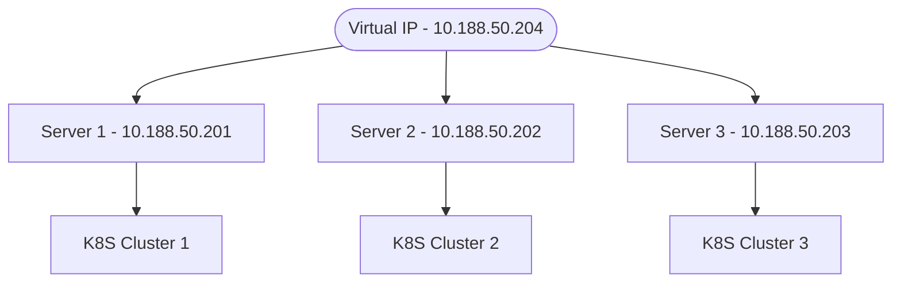
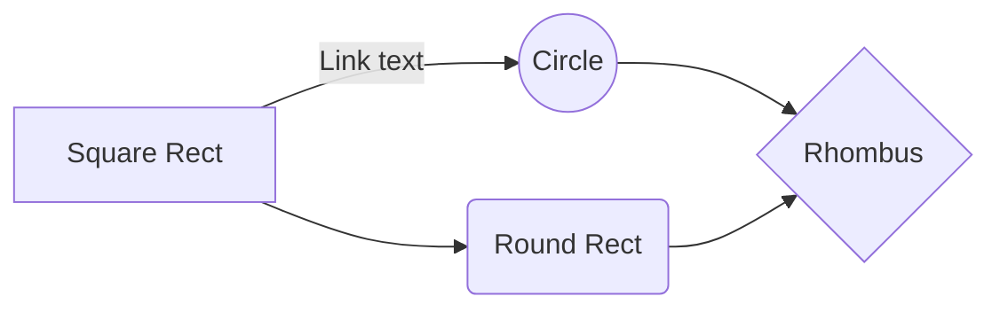
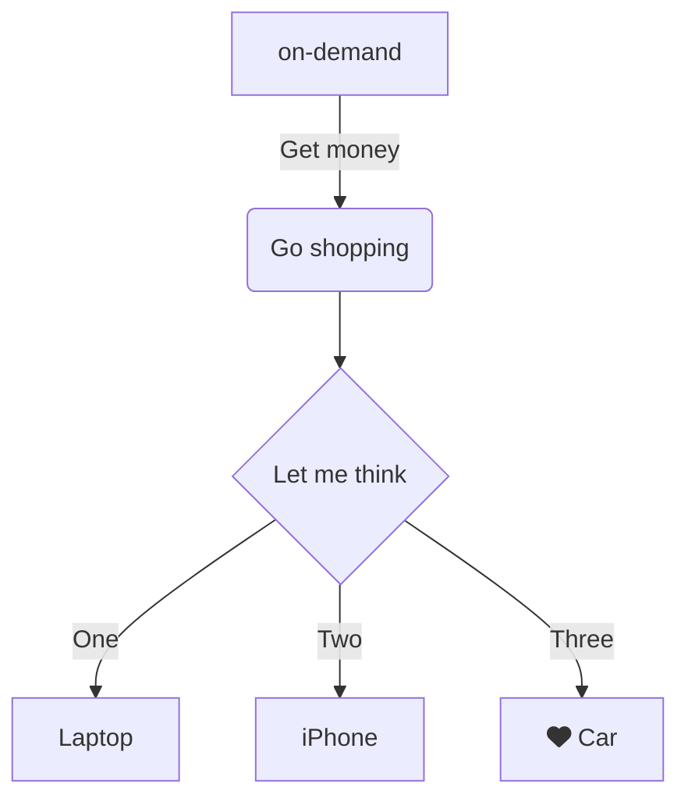

The Structures K8S Clusters are used to run our ETL pipeline microservices. The ETL pipeline collects data from the Plex ERP is highly available.

Keepalived is a software that provides high availability and load balancing for Linux systems, using the Virtual Router Redundancy Protocol (VRRP). It's designed to ensure that services remain available even if some servers fail, by managing virtual IP addresses and health checks.

<https://www.youtube.com/watch?v=hPfk0qd4xEY&t=9s>

