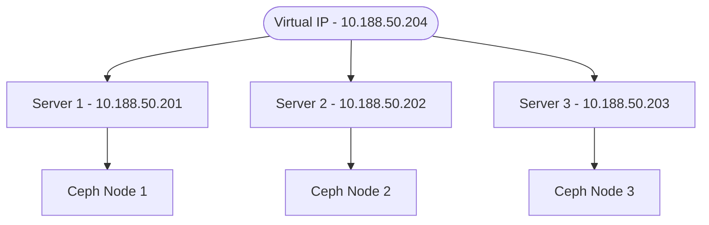

# HA Storage Demo

1. POSIX-compliant distributed file system.

Ceph, the leading open-source distributed storage system, has been ported to Windows, including RBD and CephFS. This opens new interoperability scenarios where both Linux and Windows systems can benefit from a unified distributed storage strategy, without performance compromises.

Supported Windows versions:
Windows Server 2022
Windows Server 2019
Works on Windows 10 (LTSC) and Windows 11 as well for development/testing purposes.

## Secure Boot

**Function:** Prevents unauthorized software, like malware, from loading during the boot process by verifying the digital signatures of boot components.
**Implementation:** Relies on digital signatures stored in the UEFI firmware.
**Benefit:** Protects against bootkit and rootkit attacks, ensuring a trusted operating system environment.
**Does not require TPM:** Secure Boot can operate independently of a TPM chip.

Key Differences:
Secure Boot is a feature of UEFI firmware, while TPM is a hardware component.
Secure Boot primarily focuses on preventing malware from loading during boot, while TPM focuses on providing a secure environment for cryptographic operations and platform integrity.
Secure Boot can function without a TPM, but TPM enhances the overall security posture when used with Secure Boot.
This video explains how secure boot and TPM work together to enhance security:

- make a storage pool for each department.
- give user read/write access to pool.

```bash
ceph osd lspools
# Create data/metadata pools for CephFs:
ceph osd pool create ind_cephfs_meta
ceph osd pool create ind_cephfs_data
ceph osd lspools
# Create CephFs share:
ceph fs new indFs ind_cephfs_meta ind_cephfs_data
ceph fs ls
```

Mount the filesystem:

```bash
mkdir /mnt/mycephfs
mount -t ceph :/ /mnt/mycephfs/ -o name=admin,fs=indFs
```

2. s3 compatable object storage.

- great for giving tempory links.
run python app to give temp link.
- ok if just one person is writing to files.
- good support for backups.
- not good for concurrent file access.
S3's nature: S3 is an object storage service, not a traditional filesystem. It offers strong read-after-write consistency, meaning a successful write will immediately be reflected in subsequent reads. However, it doesn't provide built-in object locking for concurrent writers.

3. view from file explorer
4. down network interface on storage cluster.
5. view from file explorer
6. copy from one drive to ceph
7. backup bucket

```bash
# rclone sync remote_name:remote_path /path/to/local/directory
rclone sync mybucket:mybucket /home/brent/backups/rclone/mybucket
```

Ceph’s RADOS Gateway, S3-compatible object storage service

- **[Ceph Storage Cluster](https://docs.ceph.com/en/reef/architecture/)**


## Summary

- Linux Administrator
- Security
- **[20 years old](https://thenewstack.io/ceph-20-years-of-cutting-edge-storage-at-the-edge/#:~:text=Ceph:%2020%20Years%20of%20Cutting,of%20Use%20and%20Privacy%20Policy.)**
- Its one of the most thoroughly documented peices of software I have ever seen.
- It has a dedicated **[foundation](https://ceph.io/en/foundation/)** made up commercial, government, and educational stakeholders.
- Provides **[LUKS](https://jumpcloud.com/blog/how-to-enable-full-disk-encryption-ubuntu-22-04)** full disk encryption.
- **[GOVERNANCE or COMPLIANCE mode for the RETENTION_MODE in S3 object lock](https://www.ibm.com/docs/en/storage-ceph/7.1.0?topic=lifecycle-enabling-object-lock-s3)**
- Ceph introduced **[BlueStore](https://ceph.io/en/news/blog/2017/new-luminous-bluestore/)**. This enables you to directly manage SSDs and HDDs without relying on conventional file systems. This innovation greatly enhanced Ceph’s performance and efficiency.
- Ceph, I’ve never seen a data loss on properly managed clusters, even when there are major failures.
- **[MicroCeph](https://canonical-microceph.readthedocs-hosted.com/)** is an opinionated orchestration tool for Ceph clusters at all scales. It reduces the complexity of deploying and managing clusters.
- You need an administrator to monitor the storage cluster.

## references

- **[Admin Guide](https://docs.ceph.com/en/latest/radosgw/admin/)**
- **[BlueStore](https://ceph.io/en/news/blog/2017/new-luminous-bluestore/)**
- **[20 years old](https://thenewstack.io/ceph-20-years-of-cutting-edge-storage-at-the-edge/#:~:text=Ceph:%2020%20Years%20of%20Cutting,of%20Use%20and%20Privacy%20Policy.)**
- **[Performance Tuning](https://ceph.io/en/news/blog/2022/rocksdb-tuning-deep-dive/)**

- HAProxy with KeepAliveD


