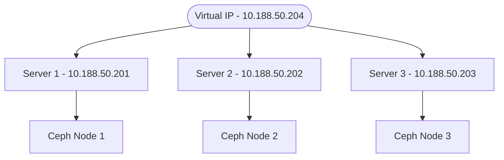

# HA Storage Cluster

Ceph’s RADOS Gateway, S3-compatible object storage service

- **[Ceph Storage Cluster](https://docs.ceph.com/en/reef/architecture/)**

## Summary

- **[20 years old](https://thenewstack.io/ceph-20-years-of-cutting-edge-storage-at-the-edge/#:~:text=Ceph:%2020%20Years%20of%20Cutting,of%20Use%20and%20Privacy%20Policy.)**
- Its one of the most thoroughly documented peices of software I have ever seen.
- It has a dedicated **[foundation](https://ceph.io/en/foundation/)** made up commercial, government, and educational stakeholders.
- Provides **[LUKS](https://jumpcloud.com/blog/how-to-enable-full-disk-encryption-ubuntu-22-04)** full disk encryption.
- **[GOVERNANCE or COMPLIANCE mode for the RETENTION_MODE in S3 object lock](https://www.ibm.com/docs/en/storage-ceph/7.1.0?topic=lifecycle-enabling-object-lock-s3)**
- Ceph introduced **[BlueStore](https://ceph.io/en/news/blog/2017/new-luminous-bluestore/)**. This enables you to directly manage SSDs and HDDs without relying on conventional file systems. This innovation greatly enhanced Ceph’s performance and efficiency.
- Ceph, I’ve never seen a data loss on properly managed clusters, even when there are major failures.
- **[MicroCeph](https://canonical-microceph.readthedocs-hosted.com/)** is an opinionated orchestration tool for Ceph clusters at all scales. It reduces the complexity of deploying and managing clusters.
- You need an administrator to monitor the storage cluster.

## references

- **[Admin Guide](https://docs.ceph.com/en/latest/radosgw/admin/)**
- **[BlueStore](https://ceph.io/en/news/blog/2017/new-luminous-bluestore/)**
- **[20 years old](https://thenewstack.io/ceph-20-years-of-cutting-edge-storage-at-the-edge/#:~:text=Ceph:%2020%20Years%20of%20Cutting,of%20Use%20and%20Privacy%20Policy.)**
- **[Performance Tuning](https://ceph.io/en/news/blog/2022/rocksdb-tuning-deep-dive/)**

- HAProxy with KeepAliveD

