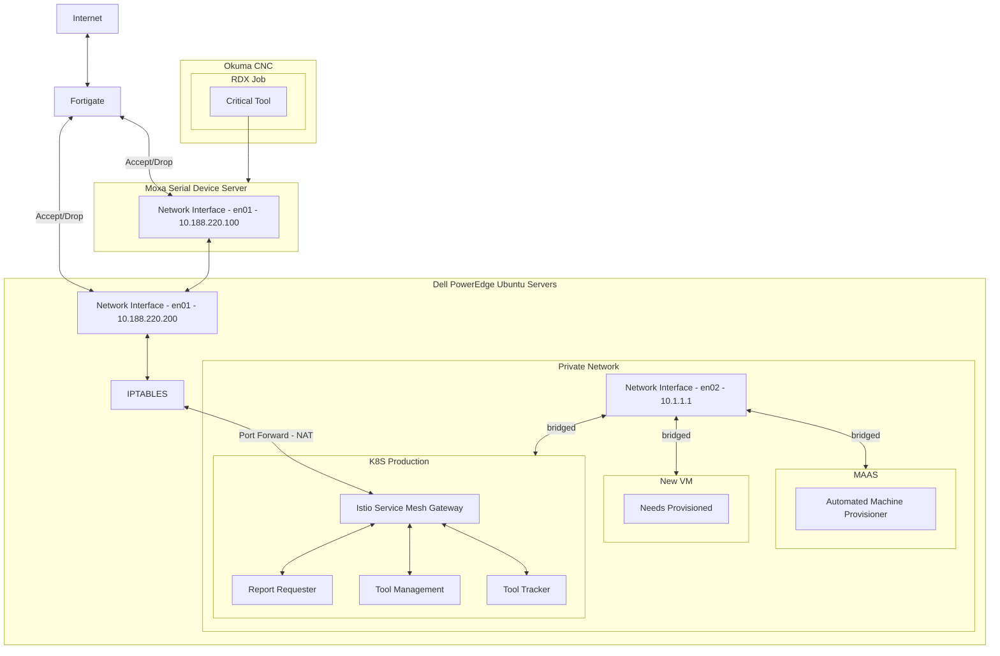

# Avilla Structures On-Prem Kubernetes Cluster Status

Approval for the Avilla Structures On-Prem Kubernetes Cluster IP Firewall config request has been granted for the week of Feb 10th, or later.  This week we will have unrestricted internet access to set up our 3 Dell R620 PowerEdge Servers using IP addresses on the Avilla OT VLAN. After this week, Justin will attempt to create a firewall ruleset based on the attached spreadsheet that will give our K8s Cluster the access it needs for day-to-day operations. 

Thank you all for your help with this.

- Sincerely,
Brent Groves

## Players

- Justin Langille
- Jared Davis
- Christian Trujillo
- Kevin Young
- Dan Martin
- Heather Luttrell

The following is a configuration summary and network Flow diagram of the setup we intend to create.  

## Software (excluding K8s platform applications)

- Automated Report System
- Tool Management System
- Tool Tracker MES

## Hardware Summary

- 3 R620 Dell PowerEdge Ubuntu Servers
- 2 with identical configurations for redundancy
- 1 for development

### Network Flow Chart

The following is a mermaid diagram and can be viewed from <https://mermaid.live/>

