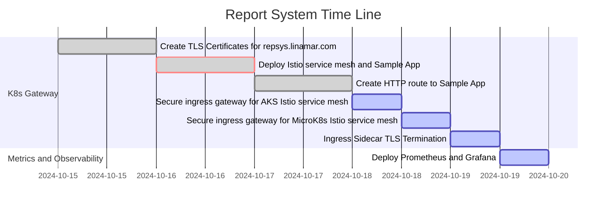
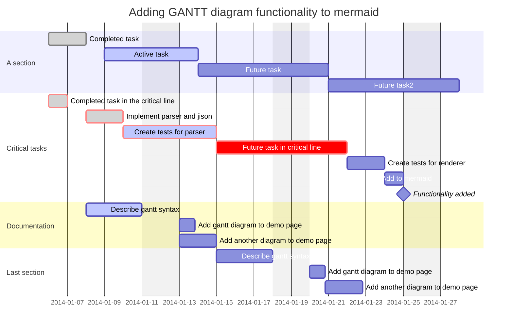

# Task List

**[Development Menu](./menu.md)**\
**[Current Status](../status/weekly/current_status.md)**\
**[Back to Main](../../README.md)**

## references

- **[gantt](https://mermaid.js.org/syntax/gantt.html)**

| Setup **[kubernetes](https://kubernetes.io/docs/concepts/overview/)** clusters on-prem at Avilla with **[MicroK8s](https://microk8s.io/docs)** and in the cloud on **[Azure AKS](https://learn.microsoft.com/en-us/azure/aks/what-is-aks)**                                                                                                          | 2 weeks |
|------------------------------------------------------------------------------------------------------------------------------------------------------------------------------------------------------------------------------------------------------------------------------------------------------------------------------------------------------|---------|
| Create TLS Clint/Server certificate for repsys.linamar.com  using our internal **[PKI](https://www.keyfactor.com/education-center/what-is-pki/)** built with **[OpenSSL](https://www.golinuxcloud.com/openssl-create-certificate-chain-linux/)** that passes SAN certificate validation at **[Sectigo Certificate Linter](https://crt.sh/lintcert)** | 1 day   |
| **[Deploy Istio and Sample App on MicroK8s](../../k8s/istio-install-part-1.md)**                                                                                                                                                                                                                                                                     | 1 day   |
| **[Deploy Istio and Sample App on Azure AKS](../../k8s/istio-install-aks.md)**                                                                                                                                                                                                                                                                       | 3 day   |
| **[Setup secure ingress gateway for Istio service mesh add-on for Azure Kubernetes Service](../../../azure/mobexglobal.com/aks/istio_secure_gateway.md)**                                                                                                                                                                                            | 1 day   |
| **[Setup Secure ingress gateway for Istio service mesh on MicroK8s](../../k8s/istio-install-part-2.md)**                                                                                                                                                                                                                                             | 1 day   |
| **[Deploy Kiali, Prometheus, and Grafana for observability](../../k8s/istio-install-part-1.md)**                                                                                                                                                                                                                                                     | 1 day   |
| Configure Istio service mesh for Auth0 authentication                                                                                                                                                                                                                                                                                                | 3 days  |
| **[Deploy Prometheus and Grafana to Azure AKS](../../k8s/istio-install-aks.md)**                                                                                                                                                                                                                                                                     | 1 day   |

## Report System Task List

## example gantt

