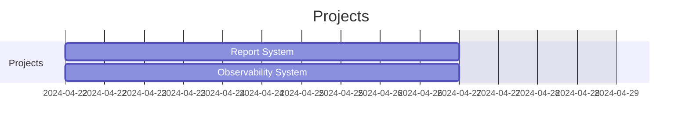
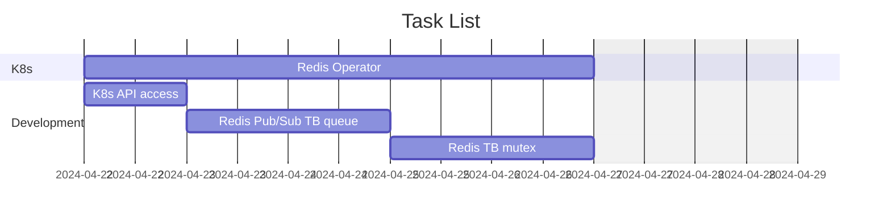
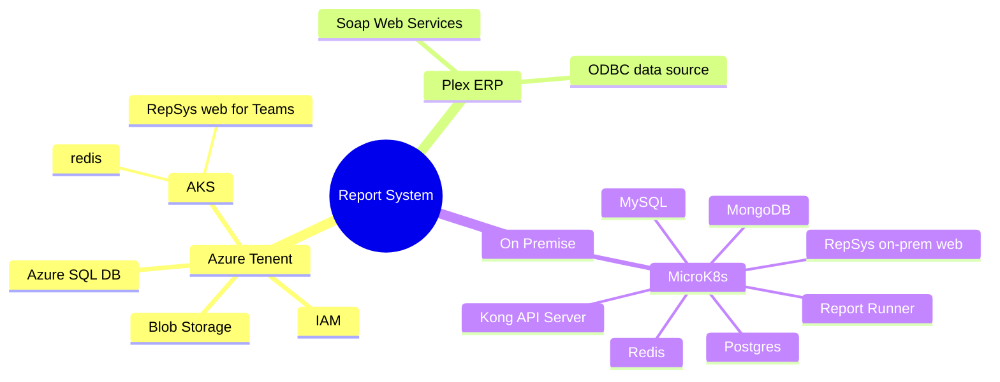
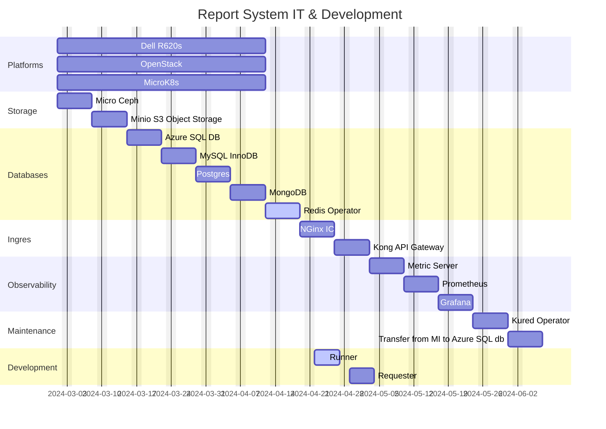
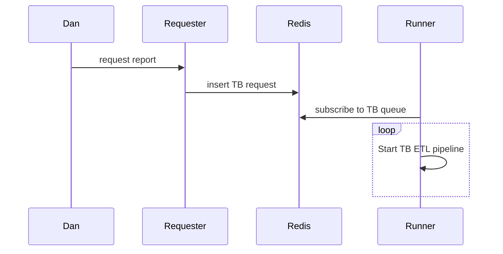
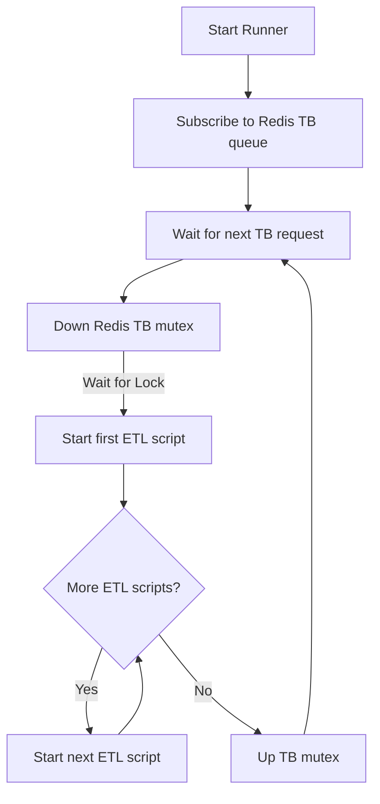

# Report System Status

## Report System

An On-Premise and Cloud-based observable K8s data warehouse reporting system.

## **[Observability System](https://www.ibm.com/blog/kubernetes-observability/)**

Identify and escalate CNC maintenance and engineering issues which lead to rejections and low efficiencies.

- CNC operators' enter tickets in Plex concerning issues that could cause a rejection.
- Program automatically enters tickets in Plex by monitoring CNC tool, pallet, and cycle times.
- Use our report system to communicate and escalate issues.

## Run TB Report

## Trial Balance Runner

