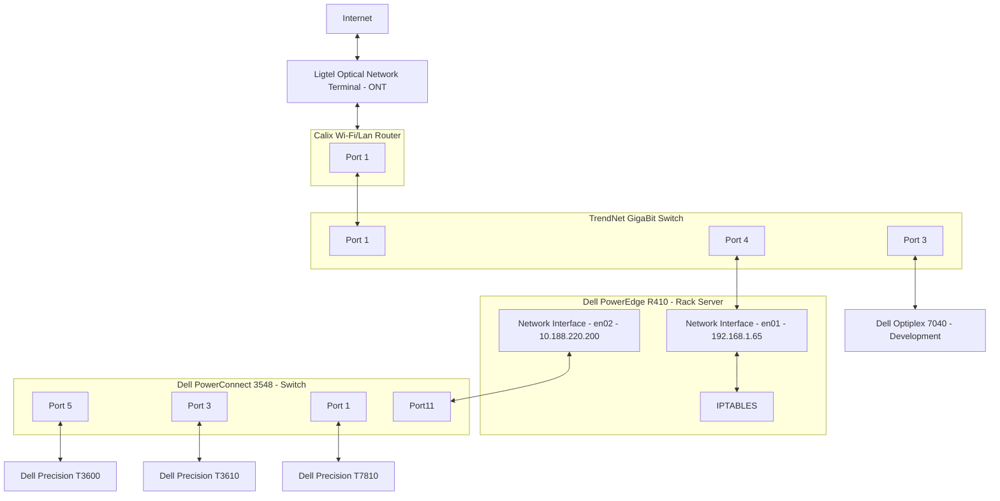

# Home Data Center Network Configuration

**[Development Menu](./menu.md)**\
**[Current Status](../status/weekly/current_status.md)**\
**[Back to Main](../../README.md)**

## Hardware Summary

- 1 R410 Dell PowerEdge Ubuntu Server
- 3 Dell Optiplex Ubuntu Servers
- 1 Dell Optiplex 7040 (Development System)
- 1 Dell Precision 3600 (K8S node 1)
- 1 Dell Precision 3610 (K8S node 2)
- 1 Dell Precision 7810 (K8S node 3)
- 1 Ligtel Optical Network Terminal (ONT)
- 1 The Calix GigaSpire u4/u4m
  - 80x.11ax, 4x4 Wi-Fi 6 antenna array, with 2x2 @ 5 GHz and 2x2 @ 2.4 GHz​
  - 2 x GigE LAN ports​
  - 1 x GigE WAN port​
  - 1 x USB 3.0 (Type A)
  - Enhanced PuF security
  - Managed by Calix Service Cloud
- 1 TrendNet GigaBit Switch
- 1 Dell PowerConnect 3548  

### Network Flow Chart

The following is a mermaid diagram and can be viewed from <https://mermaid.live/>

