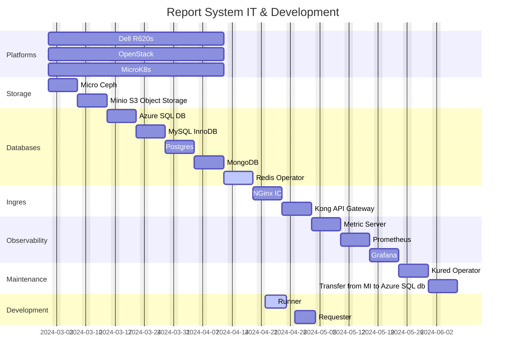

# All Software Gnatt Chart

```mermaid
gantt
    dateFormat  YYYY-MM-DD
    title       Report System IT & Development
    excludes    weekends
    %% (`excludes` accepts specific dates in YYYY-MM-DD format, days of the week ("sunday") or "weekends", but not the word "weekdays".)

    section Platforms
    Dell R620s                :p1,2024-03-01,30d
    OpenStack                 :p2,2024-03-01,30d
    MicroK8s                  :p3,2024-03-01,30d

    section Storage
    Micro Ceph                :s1,2024-03-01,5d
    Minio S3 Object Storage   :s2,after s1, 5d

    section Databases
    Azure SQL DB              :db1,after s2,5d
    MySQL InnoDB              :db2,after db1,5d
    Postgres                  :db3, after db2, 5d
    MongoDB                   :db4, after db3, 5d
    Redis Operator            :active,db5, after db4, 5d

    section Ingres
    NGinx IC                  :i1,after db5, 5d
    Kong API Gateway          :i2, after i1, 5d  

    section Observability
    Metric Server             :o1,after i2,5d
    Prometheus                :o2,after o1,5d
    Grafana                   :o3,after o2,5d

    section Maintenance
    Kured Operator            :m1,after o3, 5d
    Transfer from MI to Azure SQL db :m2, after m1,5d

    section Development
    Runner                  :active,d1,2024-04-22,5d
    Requester               :d2,after d1,5d

```
