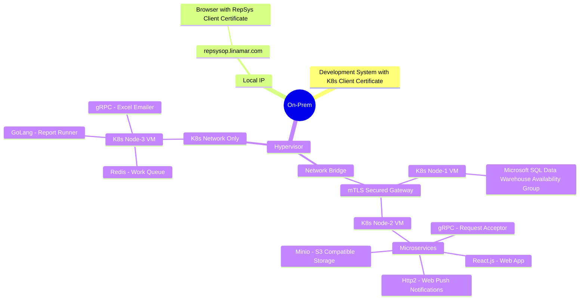
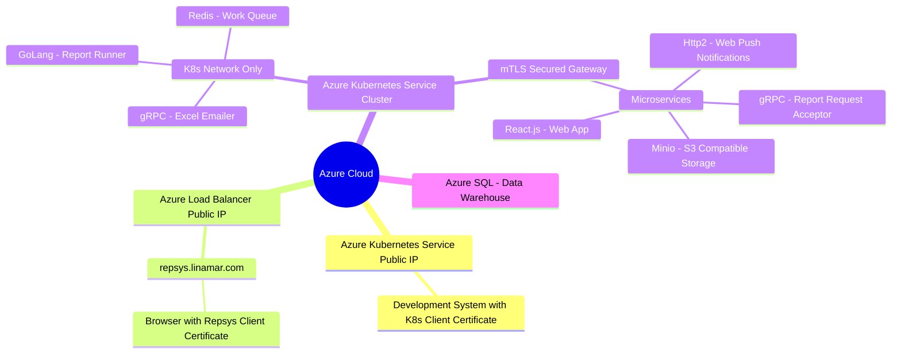

# Report System K8s Clusters Mindmap

**[Development Menu](./menu.md)**\
**[Current Status](../status/weekly/current_status.md)**\
**[Back to Main](../../README.md)**

The following is a mermaid mindmap and can be viewed from <<https://mermaid.live/>

## On-Prem Kubernetes Cluster

## Azure AKS Cluster

