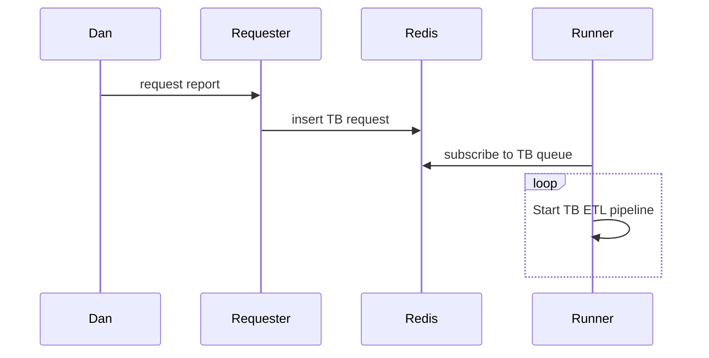

# Report FLow Sequece Diagram

## Run TB Report

```mermaid
sequenceDiagram
    participant dan as Dan
    participant req as Requester
    participant red as Redis
    participant run as Runner
    dan->>req: request report
    req->>red: insert TB request
    run->>red: subscribe to TB queue
    loop 
        run->>run: Start TB ETL pipeline
    end

```
