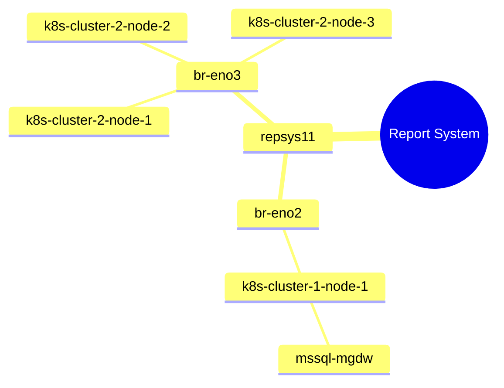

# Report System Redundant K8s Clusters

**[Development Menu](./menu.md)**\
**[Current Status](../status/weekly/current_status.md)**\
**[Back to Main](../../README.md)**

```mermaid
mindmap
  root((Report System))
    repsys11
      br-eno2
        k8s-cluster-1-node-1
          mssql-mgdw
      br-eno3
        k8s-cluster-2-node-1
        k8s-cluster-2-node-2
        k8s-cluster-2-node-3

```
