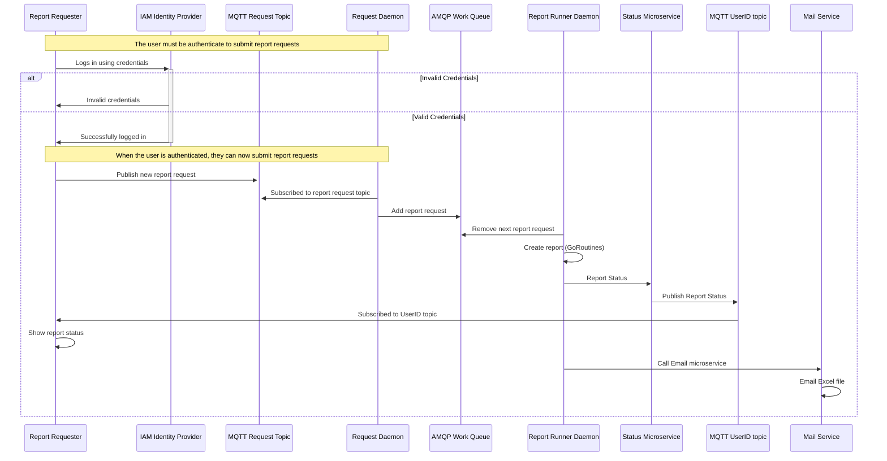

# Sequence and Block diagram

**[Development Menu](./menu.md)**\
**[Current Status](../status/weekly/current_status.md)**\
**[Back to Main](../../README.md)**

## reference

- **[block](https://mermaid.js.org/syntax/block.html)**

## Block Diagram

## Flow Summary

1. Customer requests report from requester web app. 
2. Request published to request topic of MQTT broker.
3. Request dispatch daemon subscribes to request topic.
4. Request daemon pushes new request to appropriate report queue of AMQP broker.
5. First report runner daemon to pull request from queue processes the request.
6. runner daemon calls report status microservice after each ETL script or error to the user's private topic in MQTT broker.
7. runner daemon calls emailer microservice to email Excel file.

## Sequence Diagram

