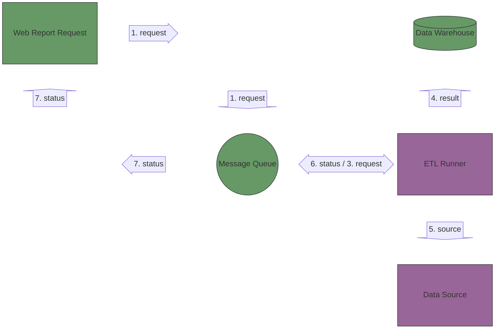
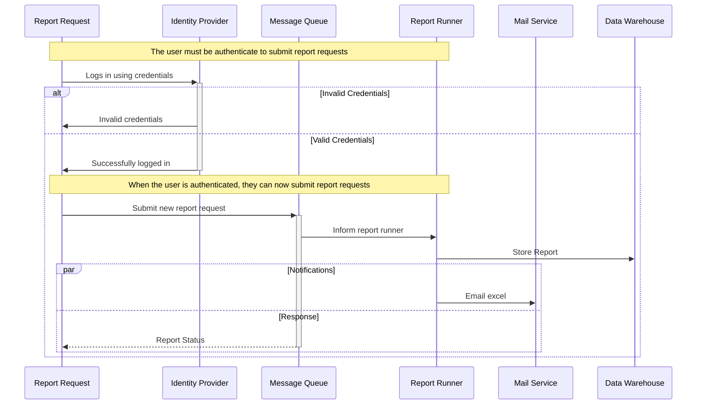

# Sequence and Block diagram

**[Development Menu](./menu.md)**\
**[Current Status](../status/weekly/current_status.md)**\
**[Back to Main](../../README.md)**

## reference

- **[block](https://mermaid.js.org/syntax/block.html)**

## Block Diagram

## Sequence Diagram

