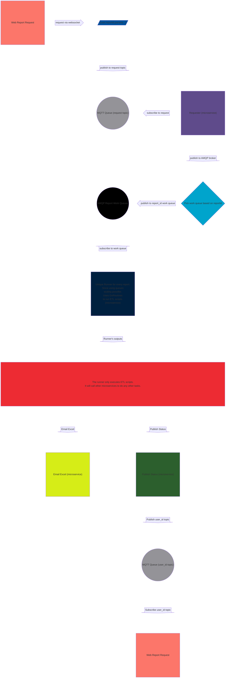
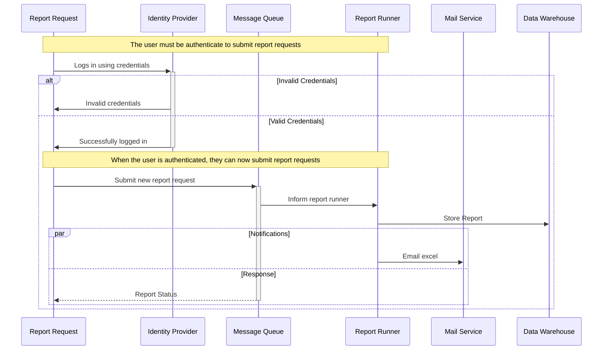

# Sequence and Block diagram

**[Development Menu](./menu.md)**\
**[Current Status](../status/weekly/current_status.md)**\
**[Back to Main](../../README.md)**

## reference

- **[block](https://mermaid.js.org/syntax/block.html)**

## Block Diagram

## Flow Summary

1. Customer requests a report
2. Request published to request topic of MQTT broker.
3. Requester microservice subscribes to request topic.
4. Requester adds request to unique report queue of AMQP broker.
5. Report runner, 1 or more runners for each possible report.
6. Runner publishes status to the user's private topic.
7. Requester subcribes to logged in user's topic.
8. Requester shows request status
9. Emailer microservice Email's Excel file

## Sequence Diagram

