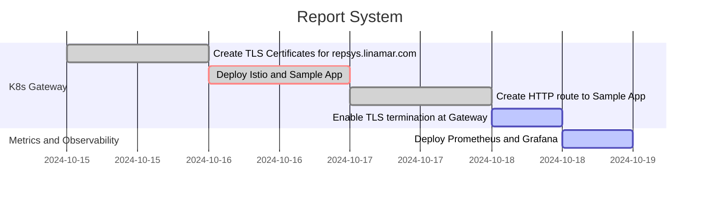
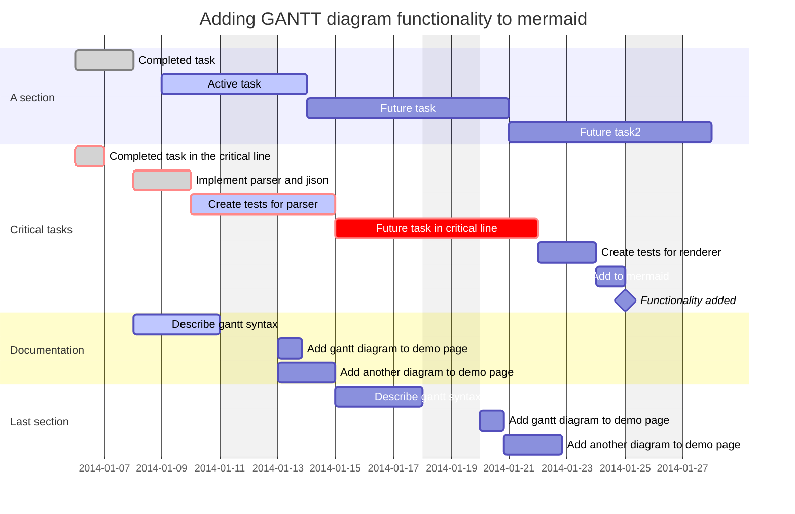

# Task List

**[Development Menu](./menu.md)**\
**[Current Status](../status/weekly/current_status.md)**\
**[Back to Main](../../README.md)**

## references

- **[gantt](https://mermaid.js.org/syntax/gantt.html)**

## Task Notes

- **[Test k8s.io from within Cluster](https://github.com/kubernetes/client-go/blob/master/examples/in-cluster-client-configuration/main.go)**
  - read database passwords from k8s secret and write to k8s log.
- **[Research Redis mutex](https://dev.to/jdvert/handling-mutexes-in-distributed-systems-with-redis-and-go-5g0d)**
- **[Research Redis Pub/Sub](https://redis.io/docs/latest/develop/interact/pubsub/)**
- **[In-Cluster K8s API access](https://github.com/kubernetes/client-go/tree/master/examples/in-cluster-client-configuration)**
- **[Out-of-Cluster K8s API access](https://github.com/kubernetes/client-go/blob/master/examples/out-of-cluster-client-configuration/README.md)**
- **[Sessions and Cookies](https://www.sohamkamani.com/web-security-basics/#sessions-and-cookies)**
