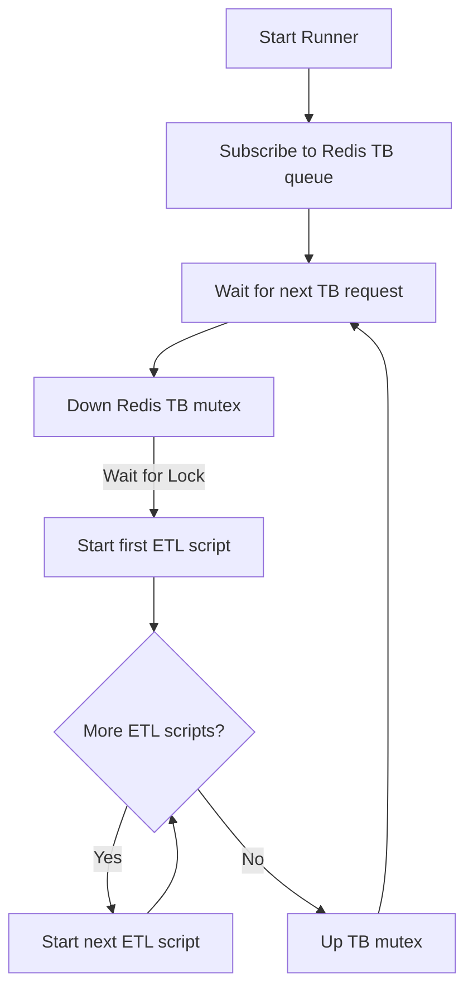

# Trial Balance Runner Flow Chart

```mermaid
flowchart TB
    start[Start Runner] --> subscribe_queue[Subscribe to Redis TB queue]
    subscribe_queue --> wait_tb_request[Wait for next TB request] 
    wait_tb_request --> down_mutex[Down Redis TB mutex]
    down_mutex -- Wait for Lock --> start_first_script[Start first ETL script]
    start_first_script --> more_scripts{More ETL scripts?}
    more_scripts -- Yes --> start_next_script[Start next ETL script]
    start_next_script --> more_scripts
    more_scripts -- No --> up_mutex[Up TB mutex]
    up_mutex --> wait_tb_request[Wait for next TB request]
```
