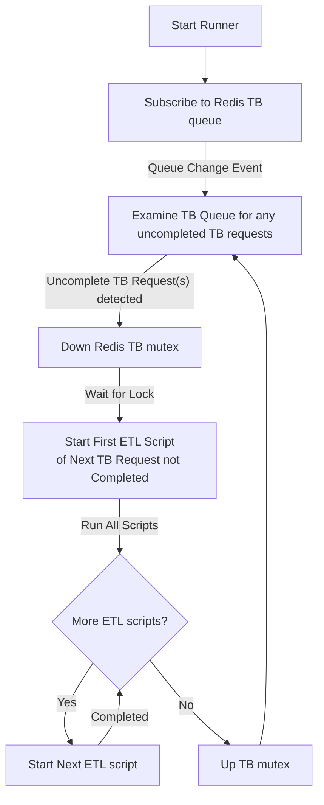

# Trial Balance Runner Flow Chart

**[Back](./menu.md)**

```mermaid
flowchart TB
    start[Start Runner] --> subscribe_queue[Subscribe to Redis TB queue]
    subscribe_queue -- Queue Change Event --> wait_tb_request[Examine TB Queue for any uncompleted TB requests] 
    wait_tb_request -- Uncomplete TB Request(s) detected --> down_mutex[Down Redis TB mutex]
    down_mutex -- Wait for Lock --> start_first_script_not_completed[Start First ETL Script\nof Next TB Request not Completed]
    start_first_script_not_completed -- Run All Scripts -->
    more_scripts{More ETL scripts?} -- Yes --> start_next_script[Start Next ETL script]
    start_next_script -- Completed --> more_scripts
    more_scripts -- No --> up_mutex[Up TB mutex]
    up_mutex --> wait_tb_request
```
