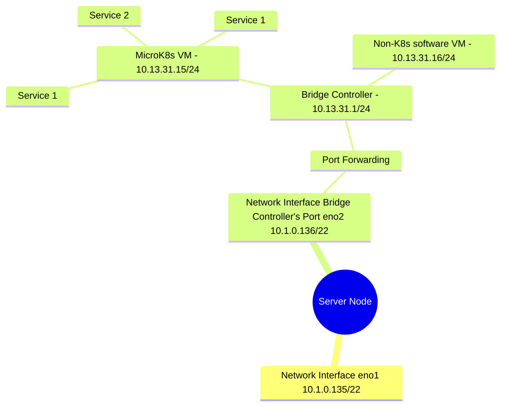

# VM Network

**[Development Menu](./menu.md)**\
**[Current Status](../status/weekly/current_status.md)**\
**[Back to Main](../../README.md)**
10.13.31.13

```mermaid
mindmap
  root((Server Node))
      Network Interface eno1 10.1.0.135/22
      Network Interface Bridge Controller's Port eno2 10.1.0.136/22
        Port Forwarding
          Bridge Controller - 10.13.31.1/24
            MicroK8s VM - 10.13.31.15/24
              Service 1
              Service 2
              Service 1
            Non-K8s software VM - 10.13.31.16/24
            ::icon(fa fa-book)

```
