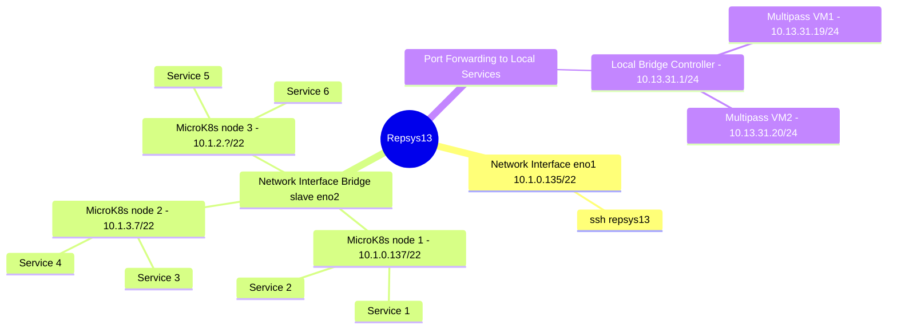

# Virtual Network

**[Development Menu](./menu.md)**\
**[Current Status](../status/weekly/current_status.md)**\
**[Back to Main](../../README.md)**

```mermaid
mindmap
  root((Repsys13))
      Network Interface eno1 10.1.0.135/22
        ssh repsys13
      Network Interface Bridge slave eno2 
        MicroK8s node 1 - 10.1.0.137/22
          Service 1
          Service 2
        MicroK8s node 2 - 10.1.3.7/22
          Service 3
          Service 4
        MicroK8s node 3 - 10.1.2.?/22
          Service 5
          Service 6
     Port Forwarding to Local Services
        Local Bridge Controller - 10.13.31.1/24
          Multipass VM1 - 10.13.31.19/24
          Multipass VM2 - 10.13.31.20/24

```
