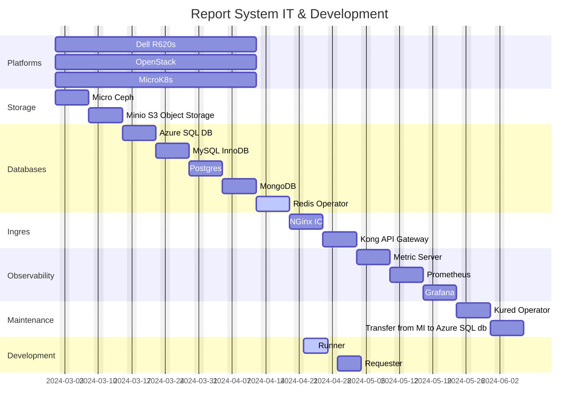

# Report System Status

## Note

This is pure markdown but does not look good.

This is a work in progress.  When finished we will have a Microsoft Teams tab accessible way to request, view, and archive both parameterized reports requiring long running SQL scripts and those requiring live Plex data. It will also be able to use the **[Azure Graph API](https://learn.microsoft.com/en-us/graph/overview)** to email excel files or about anything else having to do with any Microsoft apps.

## **[View in GitHub](https://github.com/brentgroves/repsys/blob/main/development/status/2024/week18.md)**

## references

- **[Markdown Mermaid extension](https://marketplace.visualstudio.com/items?itemName=bierner.markdown-mermaid)**
- **[JebBrains IDE](https://www.jetbrains.com/guide/go/tips/mermaid-js-support-in-markdown/)**
- **[Mermaid Live Editor](https://mermaid.live/edit)** (Also supports copy from Github gists and saving to .svg .png)

## Task Notes

- **[Research Redis mutex](https://dev.to/jdvert/handling-mutexes-in-distributed-systems-with-redis-and-go-5g0d)**
- **[Research Redis Pub/Sub](https://redis.io/docs/latest/develop/interact/pubsub/)**
- Create K8s API tutorial in **[go/tutorials/k8s](~/src/repsys/volumes/go/tutorials/k8s)**
  - **[In-Cluster K8s API access](https://github.com/kubernetes/client-go/tree/master/examples/in-cluster-client-configuration)**
  - **[Out-of-Cluster K8s API access](https://github.com/kubernetes/client-go/blob/master/examples/out-of-cluster-client-configuration/README.md)**

## Run TB Report

## Trial Balance Runner

