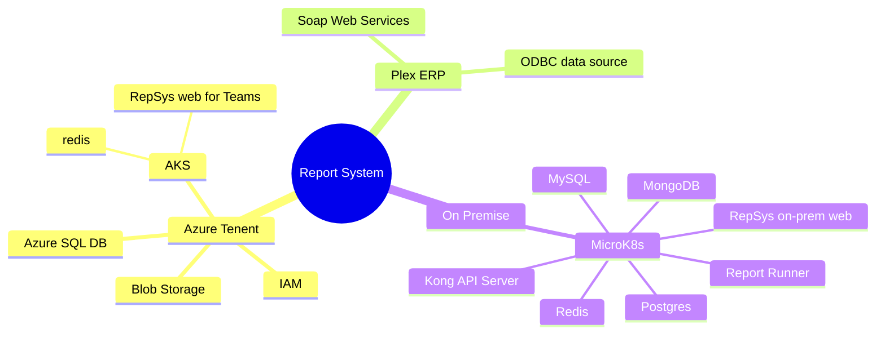

# Mobex Azure AKS and Azure SQL database resources future

Mobex was planning on using an AKS single-node cluster and an Azure SQL database to host a report request web application and I would like to know what has been decided concerning the future of these resources. I thought it was previously decided to keep them in the Mobex Azure tenant but now I hear the Mobex Active Directory is going away in March. Will we still have access to these resources after the Mobex Active Directory is decommissioned?  If not then I would like to request the following resources be created in another Azure Linamar tenant.

## Costs

- $285/month Azure AKS single-node cluster
- $50/month Azure SQL database.

## Azure Resource Details

```bash
# login into Mobex Global tenant
az login
# Subscription name: sub_mgmain_itservices  
# Subscription ID: f7d0cfcb-65b9-4f1c-8c9d-f8f993e4722a  
# Tenant: Mobex Global

# How we created the resource group
az group create --name repsys --location "East US" --tags "repsys reporting system"

# Show resource group
az group show --resource-group repsys 

# We added the contributor role using subscription scope
az role assignment create --assignee "bgroves@mobexglobal.com" \
--role "Contributor" \
--scope "/subscriptions/f7d0cfcb-65b9-4f1c-8c9d-f8f993e4722a"
# But we could have restricted the contributor role to the resource group
az role assignment create --assignee "bgroves@mobexglobal.com" \
--role "Contributor" \
--scope "/subscriptions/f7d0cfcb-65b9-4f1c-8c9d-f8f993e4722a/resourceGroups/repsys"
# list role assignnemt
az role assignment list --assignee bgroves@mobexglobal.com --output json --query '[].{principalName:principalName, roleDefinitionName:roleDefinitionName, scope:scope}'

# How we created the Azure SQL server
az sql server create --name repsys --resource-group repsys --location "East US" --admin-user mgadmin --admin-password "not shown here"
# Show the server details
az sql server show --name repsys --resource-group repsys
# List specific fields of the server object
az sql server list --resource-group repsys --output json --query '[].{administratorLogin:administratorLogin,fullyQualifiedDomainName:fullyQualifiedDomainName,location:location,id:id,name:name,version:version}'

## Configure a server level firewall rule to restrict access to certain ip addresses
echo "Configuring firewall..."
az sql server firewall-rule create --resource-group repsys --server repsys -n AllowWorkIp --start-ip-address 64.184.119.118 --end-ip-address 64.184.119.118

az sql server firewall-rule create --resource-group repsys --server repsys -n "ClientIPAddress_2024-2-21_18-35-7" --start-ip-address 64.184.36.240 --end-ip-address 64.184.36.240

# list server firewall rules
az sql server firewall-rule list --resource-group repsys --server repsys --output json --query '[].{name:name,id:id,starIpAddress:startIpAddress,endIpAddress:endIpAddress}'

echo "Creating $database on $server..."
# az sql db list-editions -l eastus --service-objective S1 --show-details max-size

# Create a Standard 20 DTU database
az sql db create -g repsys -s repsys -n rsdw --edition Standard --capacity 20 --backup-storage-redundancy Geo --max-size 20GB

# list database
az sql db list --resource-group repsys --server repsys --output json --query '[].{currentSku:currentSku,id:id,databaseId:databaseId,maxSizeBytes:maxSizeBytes}'


```

## Report System Architecture



## Details

The cloud-based portion of the reporting system would have been responsible for inserting internal-customer report requests into an Azure SQL database.  It's **purpose** was meant to accept long-running or live data report requests for the Plex ERP as well as other databases as needed. There are other software components that are needed to complete this reporting system but they do not need to be hosted in the cloud such as the report runner and report status app.  The report runner would have been responsible for pulling the internal customer report requests from the Azure SQL database and then running ETL scripts to transfer and transform data from Plex and/or other databases to produce a final result set in the Azure SQL database ie. data warehouse.

## Reasons to use an Azure AKS single-node cluster and Azure SQL database

Most of the report system can run perfectly well at any location, but specifically we were going to run the other components in our on-prem Kubernetes cluster which would have been hosted at Avilla and/or Albion. But there are several reasons we chose to run at least the report requestor component in an Azure AKS single-node cluster and have our data warehouse implemented in an Azure SQL database.  

- **Performance:** If the internal customer report request web application is cloud-based it is not dependant on VPN networking performance between locations such as Fruitport, Southfield, Albion, Avilla, etc.
- **Microsoft Managed TLS Certificates:** Other advantages to hosting this report request web application in an Azure AKS cluster include TLS certificates managed by Microsoft.
- **Microsoft Teams and Azure identity management:** Another advantage is the ability to embed the report request web application into Microsoft Teams tabs gaining Active directory user identity management to decide who has access to what reports.
- **Microsoft Teams hosted PowerBI paginated reports:** Another advantage is the ability to embed paginated Power BI reports which accept report parameters for our live reporting requirements.
