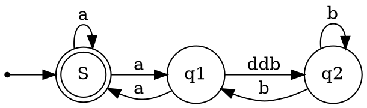

# Status

**[All Status](../weekly/status_list.md)**\
**[Back to Main](../../../README.md)**

## **[Plex ODBC](https://www.progress.com/odbc/custom-connector-sdk)**

Plex has created a Progress DataDirect ODBC driver currently we use this driver in our ETL scripts but we maybe able to use this driver in Power BI reports. If you look in our ODBC init files you will see the following 2 properties:

```bash
authmethod=iam;accesstoken=Dont_show_ourOurAccessToken;
```

## **[Access Token](https://docs.progress.com/bundle/datadirect-aha-odbc-80/page/Access-Token.html)**

Specifies the access token used to authenticate to Aha! with OAuth 2.0 enabled. Typically, this option is configured by the application; however, in some scenarios, you may need to secure a token using external processes. In those instances, you can also use this option to set the access token manually.

## **[Aha! Oauth2](https://www.aha.io/api/oauth2)**

## Plex IP restriction

- Is this similiar to Azure SQL IP restrictions.

## Updated R620s from ubuntu 22.04 desktop to 24.04 server

Using a lightweight command line hypervisor Multipass which Canonical makes.

- Did this to test netplan 1.0. It is more integrated with NetworkManagager.
- **[Install Microk8s on Multipass VM](https://microk8s.io/docs/install-multipass)**\
```multipass launch --network br0 --name microk8s-vm --mem 4G --disk 40G```

## Test Linamar Mach2 PKI

## test portforwarding on multipass test5

- **[nfttables debug](https://wiki.nftables.org/wiki-nftables/index.php/Ruleset_debug/tracing)**

## MES software

MES software monitors, tracks, documents, and controls the process of manufacturing goods from raw materials to finished products.

## So here comes MES

While SCADA is designed to control the production in real-time and ERP is designed for management of the company’s business processes, MES is designed to track and collect information about each product (semi-product) through all stages of the production process. It is a software capable of operating with big data received in real-time (PLC, SCADA), while also exchanging information with the transactional world (ERP, SCM, CRM).

MES’s purpose is to analyze and extract important information from this big data and forward it to ERP. Also, this software solution can convert work orders received from ERP to a production schedule and is capable of dispatching this schedule to the shop floor (PLC, SCADA). It is very important to properly correlate between process data and product quality and to provide and collect information in different formats from various systems.

## requirement

### Where is the data from?

- IAM/OIDC Zitadel -> Entra ID
- Web APP
- data source
  - excel
  - **[ERP/IFS](https://docs.ifs.com/techdocs/21r2/010_overview/240_integration/400_rest_apis/)**
  - from web app
- ETL scripts
- data warehouse
- Power BI report

## Cool apps

- **[No Machine RDP](https://www.nomachine.com/)**
- **[Vesktop](https://github.com/Vencord/Vesktop)**
- **[Parsec](https://parsec.app/)**

## **[Graph Visualization](https://graphviz.org/about/)**

Graph visualization is a way of representing structural information as diagrams of abstract graphs and networks. Automatic graph drawing has many important applications in software engineering, database and web design, networking, and in visual interfaces for many other domains.

Graphviz is open source graph visualization software. It has several main graph layout programs. See the Gallery for some sample layouts. It also has web and interactive graphical interfaces, and auxiliary tools, libraries, and language bindings.



## **[Modify ETL scripts to use local SQL Server container](https://github.com/microsoft/sqlworkshops-sql2019workshop/blob/master/sql2019workshop/07_SQLOnKubernetes.md)**

- Intermediate step in the report system to ensure we can always run the TB.
- The MI is backed up to a local drive and SQL server currently runs from a dockerfile.

## **[SQL Server Containers](https://learn.microsoft.com/en-us/sql/linux/sql-server-linux-docker-container-deployment?view=sql-server-ver16&pivots=cs1-bash)**

## Run production container images

The quickstart in the previous section runs the free Developer edition of SQL Server from the Microsoft Artifact Registry. Most of the information still applies if you want to run production container images, such as Enterprise, Standard, or Web editions. However, there are a few differences that are outlined here.

You can only use SQL Server in a production environment if you have a valid license. You can obtain a free SQL Server Express production license here. SQL Server Standard and Enterprise edition licenses are available through Microsoft Volume Licensing.

## Mach2 Linamar PKI

- Now #1 priority
- Ask please give notice if any plans to shutdown Azure MI in the near future.

## **[Reporting System IP Request](../../report_system/r620s.md)**

- 12 for r620s
- 4 for Albion dev system and k8s cluster
- 4 for Avilla dev system and k8s cluster

## **[IT/OT database access](../../report_system/it_ot_database.md)**

## Linamar PKI

- Lint certificate chain
- Lint kors43 SAN server certificate
- Fix any errors
- Test certificate chain
- Format kors43 certificate chain for jboss/Niagara
- Ask Sam to import certificate chain on kors43 using Niagara front-end

## **[Netfilter](../../../research/m_z/virtualization/networking/packet_classification_framework/netfilter.md)**

Netfilter is a subsystem that was introduced in the Linux 2.4 kernel that provides a framework for implementing advanced network functionalities such as packet filtering, network address translation (NAT), and connection tracking. It achieves this by leveraging hooks in the kernel’s network code, which are the locations where kernel code can register functions to be invoked for specific network events. For instance, when a packet is received, it triggers a handler for the event and performs module specified actions.

## Netfilter hooks into Linux networking packet flows

The following schematic shows packet flows through Linux networking:


## **[Network packet journey](../../../research/m_z/virtualization/networking/packet_classification_framework/network_packet_journey.md)**

- Client uses name servers to determine IP address of destination service
- Client sends network packet to IP address
- Networking devices route network packet to destination network using routing protocals such as:
  - Routing Information Protocol (RIP)
  - Interior Gateway Protocol (IGRP)
  - Open Shortest Path First (OSPF)
  - Exterior Gateway Protocol (EGP)
  - Enhanced Interior Gateway Routing Protocol (EIGRP)
  - Border Gateway Protocol (BGP)
  - Intermediate System-to-Intermediate System (IS-IS)
- Once the network packet has arrived at the destination network the network routing device uses the ARP protocol/table to determine the HW address of the network interface that is assigned to the destination IP address.
- Once the HW (MAC) address is known the network routing can also use MAC tables to determine the port of layer 2 switch in which the network interface device is attached to.
- Once the network packet arrives on the destination host's kernel via the network interface device then it's firewall determines whether to accept/reject/forward the network packet.

## **[What happens when the packet arrives at it's destination](../../../research/m_z/virtualization/networking/packet_classification_framework/iptables/iptables_netfilter_arch.md)**

In this guide, we will dive into the iptables architecture with the aim of making it more comprehensible for users who need to build their own firewall policies. We will discuss how iptables interacts with netfilter and how the various components fit together to provide a comprehensive filtering system.

## service-level agreement (SLA)

A service-level agreement (SLA) is a contract between a service provider and its customers that documents what services the provider will furnish and defines the service standards the provider is obligated to meet.

## SentinelOne, Inc

SentinelOne, Inc. is an American cybersecurity company listed on NYSE based in Mountain View, California. The company was founded in 2013 by Tomer Weingarten, Almog Cohen and Ehud Shamir. Weingarten acts as the company's CEO. Vats Srivatsan is the company's COO.

## NEXT

- **[port forwarding with nftables](https://access.redhat.com/documentation/en-us/red_hat_enterprise_linux/7/html/security_guide/sec-configuring_port_forwarding_using_nftables)**

- **[Go Backend with IAM](../../../../go_zit_backend/README.md#next)**\
Read more about how to **[generate a key file](../../../research/m_z/zitadel/key_file.md)**.

- **[Go Frontend with IAM](../../../research/m_z/zitadel/zitadel_article.md)**\
Research Zitadel IAM

- **[Go web app in Docker](https://semaphoreci.com/community/tutorials/how-to-deploy-a-go-web-application-with-docker)**

- Verify TB Power BI report runs from alb-utl and add it to repsys volume/powerbi dir.
- **[Test k8s.io from within Cluster](https://github.com/kubernetes/client-go/blob/master/examples/in-cluster-client-configuration/main.go)**
  - read database passwords from k8s secret and write to k8s log.
- Remove password from mutex tutorial.

- **[Out-of-Cluster K8s API access](https://github.com/kubernetes/client-go/blob/master/examples/out-of-cluster-client-configuration/README.md)**

## Project List

- **[Report System](../../../projects/report_system/report_system.md)**
- **[Observability System](../../../projects/observability_system/observability_system.md)**
- Mean Time to Failure

## Development

- **[Setup Development System](../../report_system/setup_dev_system/setup_dev_system.md)**
- **[IT/OT database access](../../report_system/it_ot_database.md)**
- **[Virtual Network](../../report_system/virtual_network.md)**
- **[All Software MindMap](../../report_system/all_sw_mindmap.md)**
- **[All Software Gantt](../../report_system/all_sw_gantt.md)**
- **[Report Creation Sequence Diagram](../../report_system/report_creation_sequece_diagram.md)**
- **[Trial Balance Runner Flow Chart](../../report_system/trial_balance_runner_flow_chart.md)**
- **[Task List](../../report_system/task_list.md)**
- **[Requester Mockup](../../report_system/requester_mockup/requester_mockup.md)**

## IT Admin

- **[PKI](../../../it_admin/pki/pki_menu.md)**

## Tutorials

- **[Go Tutorials](../../../volumes/go/tutorials/tutorial_list.md)**
- **[Zitadel with Go (Backend)](../../../research/m_z/zitadel/go_backend/go_backend.md)**
- **[Zitadel with Go (Frontend)](../../../research/m_z/zitadel/go_frontend/go_frontend.md)**
- **[Handling Mutexes in Distributed Systems with Redis and Go](../../../volumes/go/tutorials/redis_sentinel/mutex/tutorial_redis_mutex_go.md)**
- **[In-Cluster K8s API access](../../../volumes/go/tutorials/k8s/in_cluster_client_configuration/in-cluster-client-configuration.md)**
- **[Out-of-Cluster K8s API access](../../../volumes/go/tutorials/k8s/out-of-cluster-client-configuration/out-of-cluster-client-configuration.md)**
- **[Containerize your Go app and use semaphore for CI/CD.](../../../volumes/go/tutorials/docker/go_web_docker/go_web_docker.md)**

## Research

- **[Research List](../../../research/research_list.md)**\
A list of all research for repsys.

- **[Kernel Blog](../../../research/a_l/kernel/kernel.md)**\
The Linux kernel goes through a development cycle that is — quite frankly — insane. Some statistics from the Kernel 5.10 patch show that this release saw 252 new authors making commits into the repo (which is also the lowest amount of new contributors since 5.6), and new releases are coming out every 9 weeks. All in all, the kernel forms the solid bedrock of a large part of the computing world, but it’s not archaic by any means. All good and well, but what if you want to poke around inside it, and maybe write some code yourself? It can be a little daunting, as it’s an area of programming that most schools and boot camps don’t touch on. Plus, unlike with every flavour-of-the-month JavaScript framework that comes crawling out of the woodwork whenever you blink your eyes, you can’t go onto StackOverflow and find an odd billion or so posts to guide you through any issues.

- **[KVM networking](../../../research/m_z/virtualization/kvm/kvm_networking.md)**
There are a few different ways to allow a virtual machine access to the external network.

1. The default virtual network configuration is known as Usermode Networking. NAT is performed on traffic through the host interface to the outside network.

2. Alternatively, you can configure Bridged Networking to enable external hosts to directly access services on the guest operating system.

If you are confused, the libvirt Networking Handbook provides a good outline.

- **[Linux routing and traffic control](../../../research/m_z/virtualization/networking/routing/introduction_to_iproute2.md)** \
The 2.2 and above Linux kernels include a completely redesigned network subsystem. This new networking code brings Linux performance and a feature set with little competition in the general OS arena. In fact, the new routing, filtering, and classifying code is more featureful than the one provided by many dedicated routers and firewalls and traffic shaping products.

- **[Configure Static IPs](../../../research/m_z/virtualization/multipass/config_static_ips.md)** \
This document explains how to create instances with static IPs in a new network, internal to the host. With this approach,Netfilter e, local network we avoid any IP conflicts. Instances retain the usual default interface with a DHCP-allocated IP, which gives them connectivity to the outside.

- **[Create a bridge using iproute2](../../../research/m_z/virtualization/networking/bridge/iproute2_bridge.md)**\
This section describes the management of a network bridge using the ip tool from the iproute2 package

- **[Virtio-networking and OVS](../../../research/m_z/virtualization/networking/virtio/virtio-part1.md)**

  Virtio was developed as a standardized open interface for virtual machines (VMs) to access simplified devices such as block devices and network adaptors. Virtio-net is a virtual ethernet card and is the most complex device supported so far by virtio.

  In this post we will provide a high level solution overview of the virtio-networking architecture, based on establishing an interface between the host kernel and the VM guest kernel. We will present the basic building blocks including KVM, qemu and libvirt. We will look at the virtio spec and vhost protocol, and Open vSwitch (OVS) for connecting different VMs and connecting the outside world.


- **[Mattermost](../../../research/m_z/mattermost/mattermost.md)** \
  Mattermost is an open-source, self-hostable online chat service with file sharing, search, and integrations. It is designed as an internal chat for organisations and companies, and mostly markets itself as an open-source alternative to Slack and Microsoft Teams. Wikipedia
