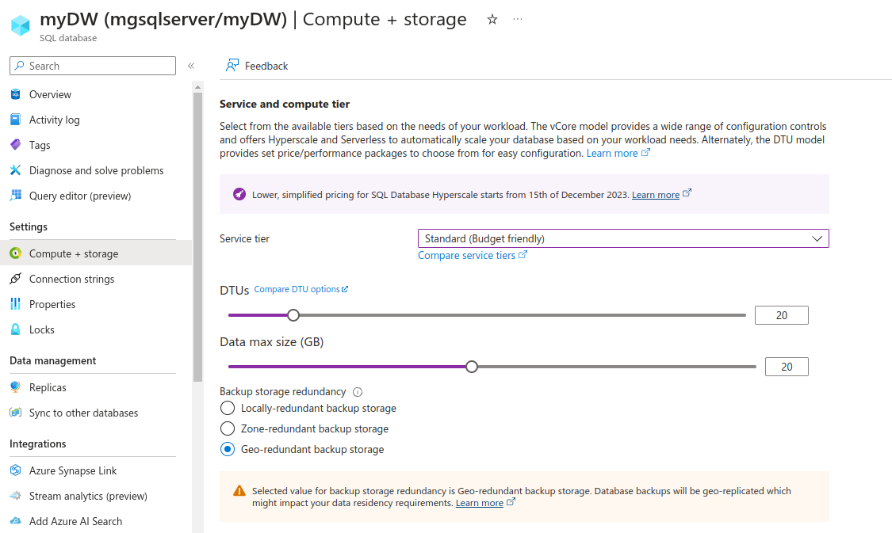

# **[Service tiers](https://blog.devart.com/what-is-azure-sql.html)**

Azure SQL Database offers several service tiers to target different workloads: Basic, Standard (General Purpose), Premium (Business Critical), and HyperScale. They all grant you appropriate performance, security, and business continuity.

- The Basic service tier is the simplest option that supports one active operation at a time. It usually suits databases for small and rarely used applications. We won’t pay close attention to it and proceed to more popular service tiers
- The Standard (General Purpose) service tier is a default option for both the Database and Managed Instance in Azure SQL. The Standard service tier can be used by most cloud apps perfectly. The storage size varies from 1GB to 4TB and Azure takes care of all upgrades and patching
- The Premium (Business Critical) service tier is designed for powerful applications that demand low-latency responses, fast recovery in case of any infrastructure failures, analyzing data loads, etc. If an application is critical for your business, you should go with the Premium service tier. The storage size is the same as for the General Purpose service tier – from 1Gb to 4 TB
- The Hyperscale service tier is a new option that is present in the vCore model only. It offers much more scalable storage with significantly more power for computing, more than in any other service tier. The size of a database can be up to 100 TB in the Hyperscale service tier and databases don’t have a definite maximal size initially. It grows when you need it. Backups and restores are performed much faster and the overall performance is much higher, no matter which data volumes it operates

## **[DTU-based purchasing model overview](https://learn.microsoft.com/en-us/azure/azure-sql/database/service-tiers-dtu?view=azuresql)**

Database transaction units (DTUs)
A database transaction unit (DTU) represents a blended measure of CPU, memory, reads, and writes. Service tiers in the DTU-based purchasing model are differentiated by a range of compute sizes with a fixed amount of included storage, fixed retention period for backups, and fixed price. All service tiers in the DTU-based purchasing model provide flexibility of changing compute sizes with minimal downtime; however, there is a switch over period where connectivity is lost to the database for a short amount of time, which can be mitigated using retry logic. Single databases and elastic pools are billed hourly based on service tier and compute size.

For a single database at a specific compute size within a service tier, Azure SQL Database guarantees a certain level of resources for that database (independent of any other database). This guarantee provides a predictable level of performance. The amount of resources allocated for a database is calculated as a number of DTUs and is a bundled measure of compute, storage, and I/O resources.

The ratio among these resources is originally determined by an online transaction processing (OLTP) benchmark workload designed to be typical of real-world OLTP workloads. When your workload exceeds the amount of any of these resources, your throughput is throttled, resulting in slower performance and time-outs.

For single databases, the resources used by your workload don't impact the resources available to other databases in the Azure cloud. Likewise, the resources used by other workloads don't impact the resources available to your database.

DTUs are most useful for understanding the relative resources that are allocated for databases at different compute sizes and service tiers. For example:

Doubling the DTUs by increasing the compute size of a database equates to doubling the set of resources available to that database.
A Premium service tier P11 database with 1750 DTUs provides 350 times more DTU compute power than a basic service tier database with 5 DTUs.
To gain deeper insight into the resource (DTU) consumption of your workload, use query-performance insights to:

Identify the top queries by CPU/duration/execution count that can potentially be tuned for improved performance. For example, an I/O-intensive query might benefit from in-memory optimization techniques to make better use of the available memory at a certain service tier and compute size.
Drill down into the details of a query to view its text and its history of resource usage.
View performance-tuning recommendations that show actions taken by SQL Database Advisor.

## Elastic database transaction units (eDTUs)

Rather than provide a dedicated set of resources (DTUs) that might not always be needed, you can place these databases into an elastic pool. The databases in an elastic pool use a single instance of the database engine and share the same pool of resources.

The shared resources in an elastic pool are measured by elastic database transaction units (eDTUs). Elastic pools provide a simple, cost-effective solution to manage performance goals for multiple databases that have widely varying and unpredictable usage patterns. An elastic pool guarantees that all the resources can't be consumed by one database in the pool, while ensuring that each database in the pool always has a minimum amount of necessary resources available.

A pool is given a set number of eDTUs for a set price. In the elastic pool, individual databases can autoscale within the configured boundaries. A database under a heavier load consumes more eDTUs to meet demand. Databases under lighter loads consume fewer eDTUs. Databases with no load consume no eDTUs. Because resources are provisioned for the entire pool, rather than per database, elastic pools simplify your management tasks and provide a predictable budget for the pool.

You can add more eDTUs to an existing pool with minimal database downtime. Similarly, if you no longer need extra eDTUs, remove them from an existing pool at any time. You can also add databases to or remove databases from a pool at any time. To reserve eDTUs for other databases, limit the number of eDTUs databases can use under a heavy load. If a database has consistently high resource utilization that impacts other databases in the pool, move it out of the pool and configure it as a single database with a predictable amount of required resources.

## Determine the number of DTUs needed by a workload

If you want to migrate an existing on-premises or SQL Server virtual machine workload to SQL Database, see SKU recommendations to approximate the number of DTUs needed. For an existing SQL Database workload, use query-performance insights to understand your database-resource consumption (DTUs) and gain deeper insights for optimizing your workload. The sys.dm_db_resource_stats dynamic management view (DMV) lets you view resource consumption for the last hour. The sys.resource_stats catalog view displays resource consumption for the last 14 days, but at a lower fidelity of five-minute averages.

## Determine DTU utilization

To determine the average percentage of DTU/eDTU utilization relative to the DTU/eDTU limit of a database or an elastic pool, use the following formula:

avg_dtu_percent = MAX(avg_cpu_percent, avg_data_io_percent, avg_log_write_percent)

The input values for this formula can be obtained from sys.dm_db_resource_stats, sys.resource_stats, and sys.elastic_pool_resource_stats DMVs. In other words, to determine the percentage of DTU/eDTU utilization toward the DTU/eDTU limit of a database or an elastic pool, pick the largest percentage value from the following: avg_cpu_percent, avg_data_io_percent, and avg_log_write_percent at a given point in time.

## Estimate Cost for 20 DTU

<!-- https://azure.microsoft.com/en-us/pricing/details/azure-sql-database/single/ -->
# Announcing New Lower Price Tier for Cloud Native Applications on Azure SQL

Today we are announcing a new pricing tier for Azure SQL Database targeted at developers building cloud native applications. It is based on Azure SQL Database Hyperscale tier, which offers awesome cloud scalability with one of the lowest TCO in the industry. Azure SQL Database Hyperscale delivers outstanding performance and scalability through adaptive, cloud native resource management, optimized for the workload patterns of each database application. Hyperscale storage scales automatically, providing consistent performance at all scales. Azure SQL Database Hyperscale provides the best database capabilities to build cloud native applications, including abilities to create APIs for your database using Data API builder, calling external endpoints, integrating with Azure functions, and more.

## references

<https://devblogs.microsoft.com/azure-sql/announcing-new-lower-price-tier-for-cloud-native-applications-on-azure-sql/>

## Market Leading Database Capabilities

Azure SQL Database Hyperscale brings three decades of SQL innovation to developers, along with the cloud scale and the latest AI capabilities. Some salient features that differentiate SQL Hyperscale database layer from the competition include:

Storage snapshot capability in Hyperscale provides fast backup and restore, that meets the aggressive requirements of cloud native workloads. Support for 30 Named Replicas allowing different compute sizes than the primary for each replica is not offered in any other cloud database service. This is a huge advantage for highly transactional and read-scalable workloads both in terms of performance as well as cost.
Named replicas in conjunction with the support for three types of secondary replicas i.e. Read Scale-Out, HA and Geo Replication make Hyperscale even more unique and differentiated.
Rapid & predictable scale up/down capability – Uniquely helps developers meet aggressive operations and sustain SLA requirements for highly scalable very large database (VLDB) systems.
Independent of database size, the Premium & Memory Optimized SKUs of Hyperscale uniquely positions it to better handle higher throughput & lower latency (using RBPEX caching) transactional workloads i.e., Hyperscale database can handle 300K+ IOPS with 128 vCores.
Growing trend of ISVs wanting to leverage SQL Database Hyperscale elastic pool capability that allows them to package many databases into an elastic pool, enabling them to optimize price-performance and database operations.

## Azure SQL Performance and Reliability at Open-source Prices

Azure SQL will continue to provide database tiers that offer the best TCO for customers migrating and modernizing. In addition to the existing SQL tiers, today we are announcing a new pricing tier for Azure SQL Database Hyperscale. We are reducing the price of compute by up to 35%. Now, with Azure SQL Database Hyperscale, anyone can avail the same rich functionality of Azure SQL, at much lower compute price, giving customers the best of both worlds – highest grade database capabilities of Azure SQL at a cost commonly associated with open-source databases, enabling customers to do more with less. Azure SQL Database Hyperscale comes with high performance, auto-scalable and multi-cache database storage, at a very competitive price. Customers have indicated to us that they love the predictable pricing model of Azure SQL Database. Azure SQL Database does not charge for database IO in any tier, including Azure SQL Database Hyperscale. You only pay for your database vCores and the storage usage, making it easy to predict your database spend up front. This accompanying blog post has more details on the new pricing.

For workloads with intermittent, unpredictable or bursty usage patterns, Azure SQL Database Hyperscale also supports serverless capability that automatically scales compute based on workload demand and bills for usage. For building multi-tenant SaaS applications, Azure SQL Database Hyperscale enables the elastic pools capability.

In summary, whether you are building a database application with 10 GB of data or 100 TB of data, for one user or millions of users, Azure SQL Database Hyperscale provides the database with industry’s best price-performance, scalability, security, and extensibility.
