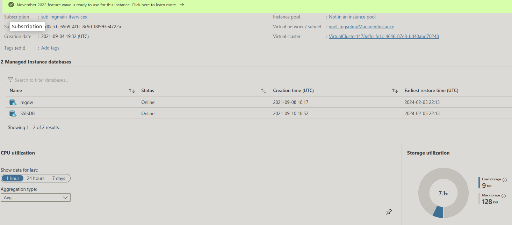
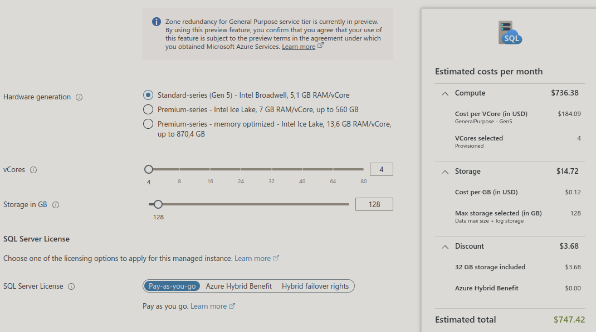
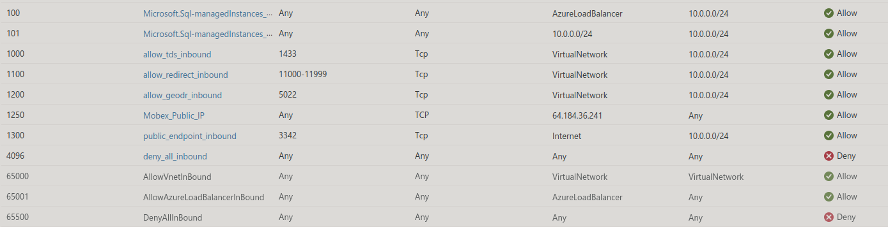

# mgdw (mgsqlmi/mgdw)

Managed database

```json
{
    "properties": {
        "collation": "SQL_Latin1_General_CP1_CI_AS",
        "status": "Online",
        "creationDate": "2021-09-08T18:17:23.557Z",
        "earliestRestorePoint": "2024-02-05T21:11:00.2320057Z",
        "defaultSecondaryLocation": "westus",
        "isLedgerOn": false
    },
    "location": "eastus",
    "id": "/subscriptions/f7d0cfcb-65b9-4f1c-8c9d-f8f993e4722a/resourceGroups/rg-useast-dataservices/providers/Microsoft.Sql/managedInstances/mgsqlmi/databases/mgdw",
    "name": "mgdw",
    "type": "Microsoft.Sql/managedInstances/databases"
}
```




## Backup

Geo-redundant backup storage

## **[Configure public end-points](https://learn.microsoft.com/en-us/azure/azure-sql/managed-instance/public-endpoint-configure?view=azuresql&tabs=azure-portal)**

- Go to the Azure portal.
- Open the resource group with the managed instance, and select the SQL managed instance that you want to configure public endpoint on.
- On the Security settings, select the Networking tab.
In the Virtual network configuration page, select Enable and then the Save icon to update the configuration.

## **[Allow plublic end-points in](https://learn.microsoft.com/en-us/azure/azure-sql/managed-instance/public-endpoint-configure?view=azuresql&tabs=azure-portal#allow-public-endpoint-traffic-in-the-network-security-group)**

- Go to the Overview page for your SQL Managed Instance in the Azure portal.
- Select the Virtual network/subnet link, which takes you to the Virtual network configuration page.
- Select the Subnets tab on the configuration pane of your Virtual network, and make note of the SECURITY GROUP name for your managed instance.
- Go back to the resource group that contains your managed instance. You should see the Network security group name noted previously. Select the Network security group name to open the Network Security Group configuration page.
- Select the Inbound security rules tab, and Add a rule that has higher priority than the deny_all_inbound rule with the following settings:


