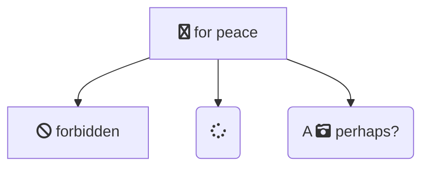
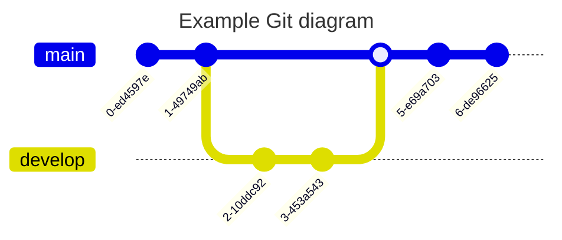
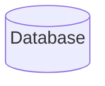
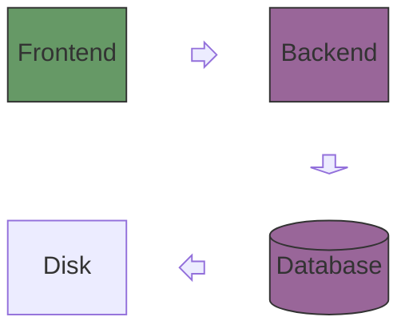
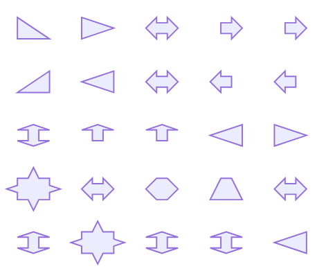
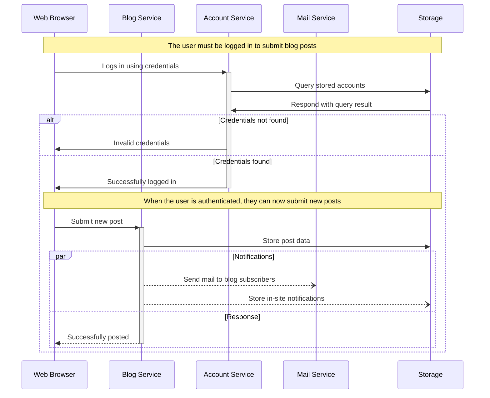
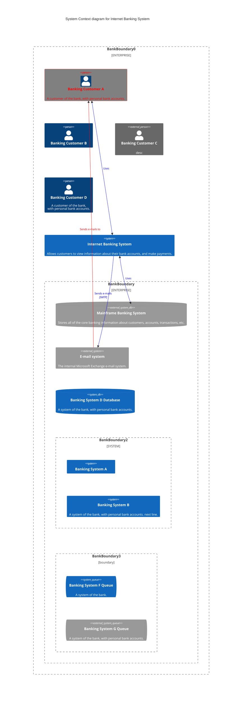
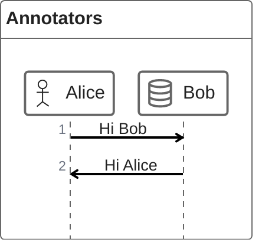

# **[how](https://github.blog/developer-skills/github/include-diagrams-markdown-files-mermaid/)**

## Enter Mermaid 🧜‍♀️🧜‍♂️

😄

Mermaid is a JavaScript based diagramming and charting tool that takes Markdown-inspired text definitions and creates diagrams dynamically in the browser. Maintained by Knut Sveidqvist, it supports a bunch of different common diagram types for software projects, including flowcharts, UML, Git graphs, user journey diagrams, and even the dreaded Gantt chart.

Working with Knut and also the wider community at CommonMark, we’ve rolled out a change that will allow you to create graphs inline using Mermaid syntax, for example:

