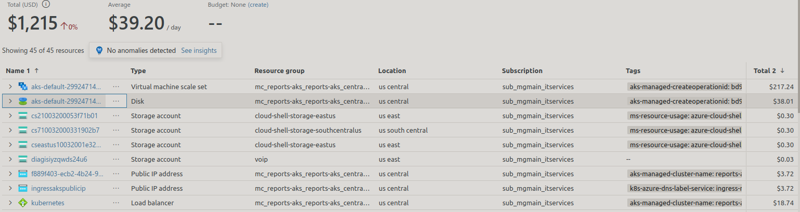

# Report services request

This is a markdown file if it looks a little strange. You could use visual studio code or an online viewer such as <https://dillinger.io/>

## Microsoft 365 E5 Plan
Need E5 or E3 plan to get needed add-ons.
Price per user/month (annual commitment)	$57.00

## Add-ons Available for Microsoft 365 E3 and E5 subscriptions
- Power Automate (need this).	Enables users to automate repetitive tasks and workflows. Available as an add-on for Microsoft 365 E3 and E5.
- Power BI Pro (need this).	Provides advanced data visualization and business intelligence features. Available as an add-on for Microsoft 365 E3 and E5.

## Azure services

- **[Azure SQL db](https://azure.microsoft.com/en-us/pricing/details/azure-sql-database/single/) (need this) - Power Automate used to copy data from Plex to DW.  All that we need with a much lower cost than Azure SQL MI. $29.4343/month
- Azure AKS (Kubernetes) (need this) - Hosts Microsoft teams accessible report request web app.
  - $ 275/month


## Azure DevOps 

Azure Repos (need this)
Get unlimited, cloud-hosted private Git repos and collaborate to build better code with pull requests and advanced file management.

Azure pipelines (nice to have)
Build, test, and deploy with CI/CD that works with any language, platform, and cloud. Connect to GitHub or any other Git provider and deploy continuously.

## repsys resource group

How to create resource group and assign contributor role.

```bash
#!/usr/bin/env bash
pushd .
cd ~/src/repsys/research/azure_sql_server/linamar
source ./vars.sh
# https://linuxize.com/post/bash-printf-command/

printf "subscription=%s \
\nlocation=%s \
\nresourceGroup=%s \
\ntag=%s \
\nserver=%s \
\ndatabase=%s \
\nlogin=%s \
\npassword=%s \
\nstartIp=%s \
\nendIp=%s" \
$subscription $location $resourceGroup \
$tag $server $database $login \
$password $startIp $endIp
az account set -s $subscription # ...or use 'az login'
echo "Using resource group $resourceGroup with login: $login, password: $password..."
echo "Creating $resourceGroup in $location..."
# https://learn.microsoft.com/en-us/cli/azure/group?view=azure-cli-latest#az-group-create
az group create --name $resourceGroup --location "$location" --tags $tag
{
  "id": "/subscriptions/f7d0cfcb-65b9-4f1c-8c9d-f8f993e4722a/resourceGroups/repsys",
  "location": "eastus",
  "managedBy": null,
  "name": "repsys",
  "properties": {
    "provisioningState": "Succeeded"
  },
  "tags": {
    "create-and-configure-database": ""
  },
  "type": "Microsoft.Resources/resourceGroups"
}

# Add user to contributor role of resource
az role assignment create --assignee "bGroves@linamar.com" \
--role "Contributor" \
--scope "/subscriptions/f7d0cfcb-65b9-4f1c-8c9d-f8f993e4722a/resourceGroups/repsys"

# Verify role has been added
az role assignment list --resource-group repsys --assignee bGroves@linamar.com --output json --query '[].{principalName:principalName, roleDefinitionName:roleDefinitionName, scope:scope}'
popd
```
- 

