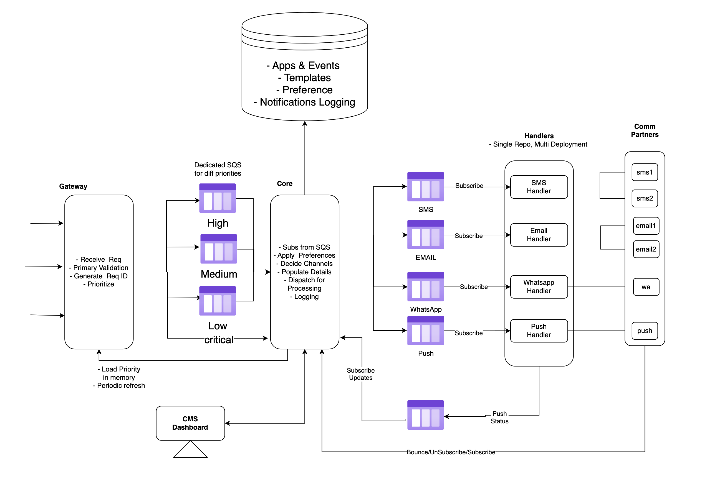

# **[Architecture](https://notifyone.1mg.com/docs/introduction/components_and_architecture)**

**[Current Status](../../../development/status/weekly/current_status.md)**\
**[Research List](../../../research/research_list.md)**\
**[Back Main](../../../README.md)**

## Components And Architecture
NotifyOne uses a highly scalable, fault-tolerant architecture. NotifyOne as been designed to suite the microservices architecture and runs as a group of services that, combined together, work for the best performance.

NotifyOne has been architected keeping in mind the actual production load and deployment strategies. The components have been decoupled keeping in mind the tasks they perform and their scaling needs.

Amazon **[Simple Queue Service](https://docs.aws.amazon.com/AWSSimpleQueueService/latest/SQSDeveloperGuide/welcome.html)** (SQS) is a managed message queuing service from Amazon Web Services (AWS) that enables users to send, store, and retrieve messages between software components

**[SQS](https://www.geeksforgeeks.org/aws-sqs/)**

- The architecture makes it easy to introduce a new channel or integrate with new providers for existing channels.

- Components like Gateway, Core and Handlers can be scaled independently based on needs.

