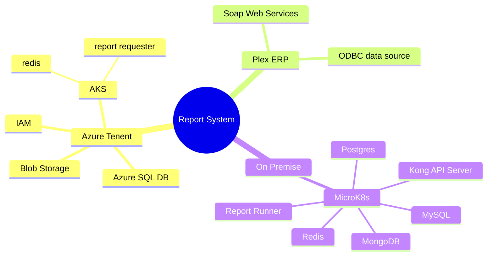
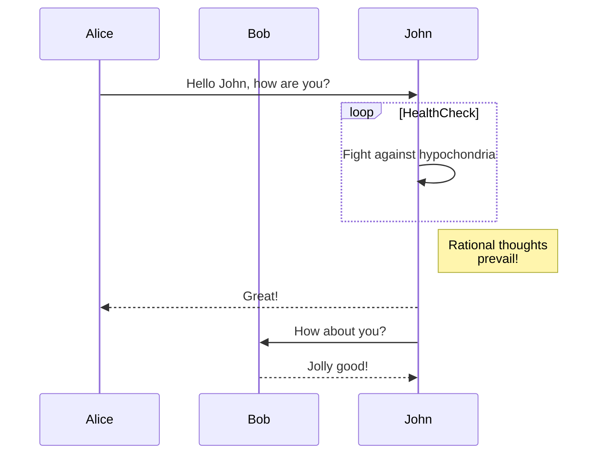
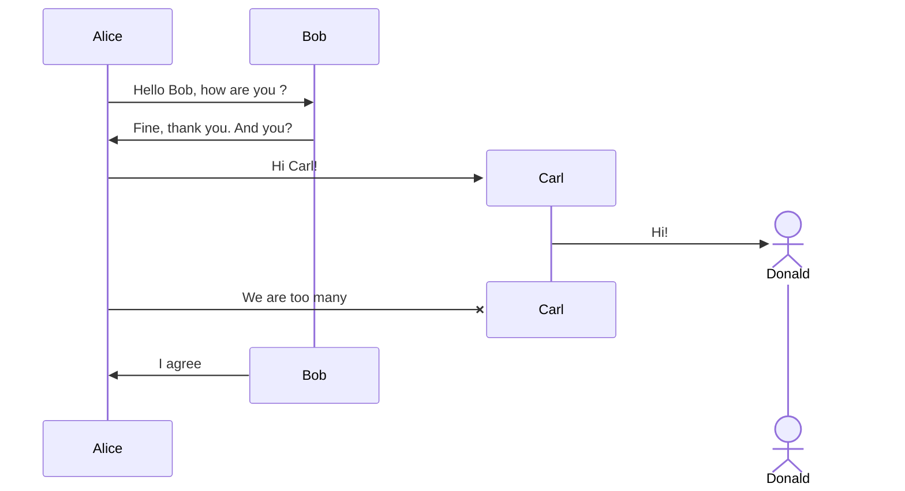
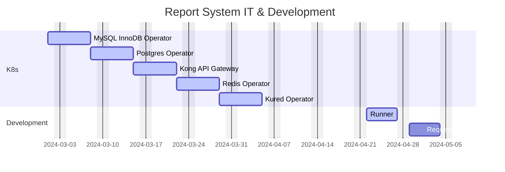
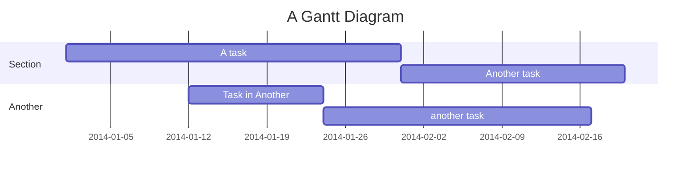

# About Mermaid

Mermaid lets you create diagrams and visualizations using text and code.

It is a JavaScript based diagramming and charting tool that renders Markdown-inspired text definitions to create and modify diagrams dynamically.

If you are familiar with Markdown you should have no problem learning Mermaid's Syntax.

## references

<https://markmap.js.org/>
<https://mermaid.js.org/intro/syntax-reference.html>
<https://mermaid.js.org/syntax/gantt.html>
<https://chromewebstore.google.com/detail/mermaid-previewer/oidjnlhbegipkcklbdfnbkikplpghfdl>

## mindmap

## flow chart

## Sequence diagram

## gnatt

