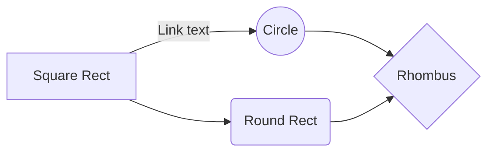
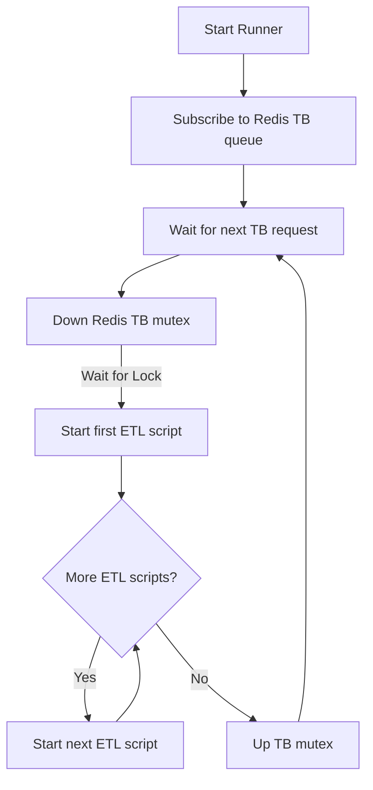
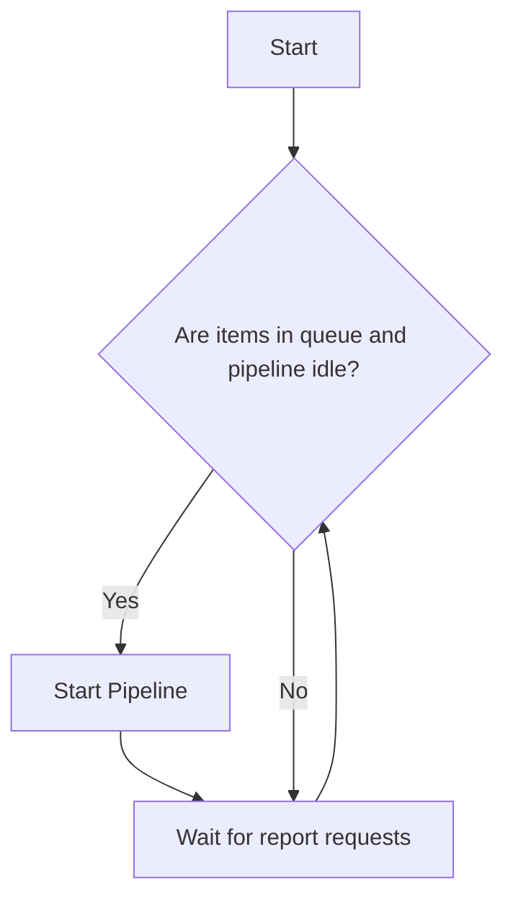

# About Mermaid

Mermaid lets you create diagrams and visualizations using text and code.

It is a JavaScript based diagramming and charting tool that renders Markdown-inspired text definitions to create and modify diagrams dynamically.

If you are familiar with Markdown you should have no problem learning Mermaid's Syntax.

## references

- <https://mermaid.live/>
- <https://github.com/mkdocs/mkdocs/>
- <https://markmap.js.org/>
- <https://mermaid.js.org/intro/syntax-reference.html>
- <https://mermaid.js.org/syntax/gantt.html>

## Docs & Tools

- **[Mermaid Docs](https://mermaid-js.github.io/mermaid/)**
- **[Mermaid Live Editor](https://mermaid.live/edit)** (Also supports copy from Github gists and saving to .svg .png)
- **[Mermaid Cheat Sheet](https://jojozhuang.github.io/tutorial/mermaid-cheat-sheet/)**

## Some Examples

- <https://gist.github.com/ChristopherA/bffddfdf7b1502215e44cec9fb766dfd>
- <https://gist.github.com/balanza/39bd68f3978ae7dd6a486321b2251ce7>
- <https://gist.github.com/vtsoup/f1f79d19d6f8e58396bde8847c09a62e>

## Feature Support: GitHub's Mermaid support has some limitations. For example

Not all Mermaid symbols are supported, like the B-->C[fa:fa-ban forbidden].
Hyperlinks and tooltips may not work within Mermaid labels.
Markdown Features: Some Markdown features are supported within Mermaid labels, but others may cause issues or break the diagram.

Character Limitations: Some characters, including certain emojis and extended ASCII characters, can cause errors in Mermaid diagrams.

Embedding Limitations: Embedding GitHub gists and pages into Mermaid diagrams might not work as expected.

## mindmap

To create a a link of this mindmap go to <https://mermaid.live/>


## flow chart




## Trial Balance Runner

The ETL pipeline is a set of Go routines (threads) each of which is responsible for 1 ETL script. The TB runner's main thread begins the ETL pipeline by sending a message the first ETL script go routine.  Each ETL script go routine completes and then calls the next ETL script's go routine.  The final ETL script finishes and then sets the TB mutex up so that the runner's main thread can start the pipeline again.

```psuedo_code
create go routines (threads) and communitcation channels for each tb etl script in tb etl pipeline
subscribe to redis tb mutex and request queue 

infinite while loop
    if tb queue not empty
        remove request from queue
        when tb mutex up
            down tb mutex 
            send request to 1st ETL script's go routine
        end
    end
```

Note:

- **[Mutex's in Redis](https://dev.to/jdvert/handling-mutexes-in-distributed-systems-with-redis-and-go-5g0d)**
- **[Publish/Subscribe](https://redis.io/docs/latest/develop/interact/pubsub/)**





## Sequence diagram


## gnatt


