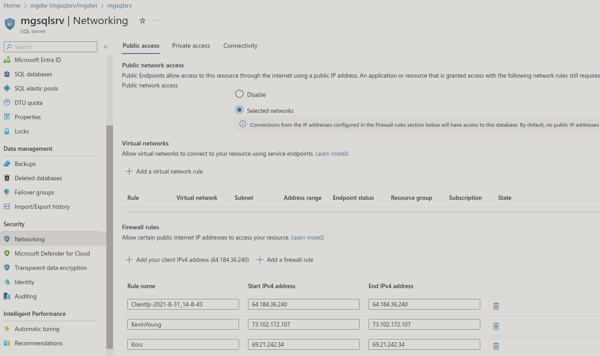

# mgdw (mgsqlsrv/mgdw)

SQL database

## resource id

```bash
/subscriptions/f7d0cfcb-65b9-4f1c-8c9d-f8f993e4722a/resourceGroups/kors/providers/Microsoft.Sql/servers/mgsqlsrv/databases/mgdw
```

```json
{
    "sku": {
        "name": "Basic",
        "tier": "Basic",
        "capacity": 5
    },
    "kind": "v12.0,user",
    "properties": {
        "collation": "SQL_Latin1_General_CP1_CI_AS",
        "maxSizeBytes": 2147483648,
        "status": "Online",
        "databaseId": "c308a1e6-28c3-44fd-a2f6-2a5ec4515519",
        "creationDate": "2021-08-31T18:12:58.19Z",
        "currentServiceObjectiveName": "Basic",
        "requestedServiceObjectiveName": "Basic",
        "defaultSecondaryLocation": "westus",
        "catalogCollation": "SQL_Latin1_General_CP1_CI_AS",
        "zoneRedundant": false,
        "earliestRestoreDate": "2024-02-05T21:56:53.8420801Z",
        "readScale": "Disabled",
        "currentSku": {
            "name": "Basic",
            "tier": "Basic",
            "capacity": 5
        },
        "currentBackupStorageRedundancy": "Geo",
        "requestedBackupStorageRedundancy": "Geo",
        "maintenanceConfigurationId": "/subscriptions/f7d0cfcb-65b9-4f1c-8c9d-f8f993e4722a/providers/Microsoft.Maintenance/publicMaintenanceConfigurations/SQL_Default",
        "isLedgerOn": false,
        "isInfraEncryptionEnabled": false,
        "availabilityZone": "NoPreference"
    },
    "location": "eastus",
    "tags": {},
    "id": "/subscriptions/f7d0cfcb-65b9-4f1c-8c9d-f8f993e4722a/resourceGroups/kors/providers/Microsoft.Sql/servers/mgsqlsrv/databases/mgdw",
    "name": "mgdw",
    "type": "Microsoft.Sql/servers/databases"
}
```


## cost


## **[How the firewall works](https://learn.microsoft.com/en-us/azure/azure-sql/database/firewall-configure?view=azuresql)**

Connection attempts from the internet and Azure must pass through the firewall before they reach your server or database, as the following diagram shows.


## **[set firewall for Azure SQL database](https://www.sqlshack.com/configure-ip-firewall-rules-for-azure-sql-databases/)**

go to Azure SQL server's dashboard and click "Set server firewall"


## **[Set up server-level firewall rules](https://learn.microsoft.com/en-us/azure/azure-sql/database/secure-database-tutorial?view=azuresql)**



## **[Set Azure SQL database firewall rule with SPROC](https://learn.microsoft.com/en-us/sql/relational-databases/system-stored-procedures/sp-set-database-firewall-rule-azure-sql-database?view=azuresqldb-current)**

Note: This may be possible with Azure SQL database but I can't access sys to verify it worked so I better stick with the **[gui for Azure SQL database](https://learn.microsoft.com/en-us/azure/azure-sql/database/secure-database-tutorial?view=azuresql#create-firewall-rules)** not on a managed instance.

```sql
SELECT * FROM sys.firewall_rules
SQL Error [40508] [S0001]: USE statement is not supported to switch between databases. Use a new connection to connect to a different database.
```

USE statement is not supported to switch between databases. Use a new connection to connect to a different database.

sp_set_database_firewall_rule (Azure SQL Database)

```bash
# Syntax
sp_set_database_firewall_rule [@name = ] [N]'name'  
, [@start_ip_address =] 'start_ip_address'  
, [@end_ip_address =] 'end_ip_address'
[ ; ]  
```

Arguments
[ @name = ] [N]'name' The name used to describe and distinguish the database-level firewall setting. name is nvarchar(128) with no default value. The Unicode identifier N is optional for SQL Database.

[ @start_ip_address = ] 'start_ip_address' The lowest IP address in the range of the database-level firewall setting. IP addresses equal to or greater than this can attempt to connect to the SQL Database instance. The lowest possible IP address is 0.0.0.0. start_ip_address is varchar(50) with no default value.

[ @end_ip_address = ] 'end_ip_address' The highest IP address in the range of the database-level firewall setting. IP addresses equal to or less than this can attempt to connect to the SQL Database instance. The highest possible IP address is 255.255.255.255. end_ip_address is varchar(50) with no default value.

The following table demonstrates the supported arguments and options in SQL Database.

Remarks
The names of database-level firewall settings for a database must be unique. If the name of the database-level firewall setting provided for the stored procedure already exists in the database-level firewall settings table, the starting and ending IP addresses will be updated. Otherwise, a new database-level firewall setting will be created.

When you add a database-level firewall setting where the beginning and ending IP addresses are equal to 0.0.0.0, you enable access to your database in the SQL Database server from any Azure resource. Provide a value to the name parameter that will help you remember what the firewall setting is for.

Permissions
Requires CONTROL permission on the database.

Examples
The following code creates a database-level firewall setting called Allow Azure that enables access to your database from Azure.

```bash
-- Enable Azure connections.  
EXECUTE sp_set_database_firewall_rule N'Allow Azure', '0.0.0.0', '0.0.0.0';  
```

The following code creates a database-level firewall setting called Example DB Setting 1 for only the IP address 0.0.0.4. Then, the sp_set_database firewall_rule stored procedure is called again to update the end IP address to 0.0.0.6, in that firewall setting. This creates a range which allows IP addresses 0.0.0.4, 0.0.0.5, and 0.0.0.6 to access the database.

```bash
-- Create database-level firewall setting for only IP 0.0.0.4  
EXECUTE sp_set_database_firewall_rule N'Example DB Setting 1', '0.0.0.4', '0.0.0.4';  
  
-- Update database-level firewall setting to create a range of allowed IP addresses
EXECUTE sp_set_database_firewall_rule N'Example DB Setting 1', '0.0.0.4', '0.0.0.6';  
```

```bash
Use Transact-SQL to manage IP firewall rules
Catalog view or stored procedure Level Description
sys.firewall_rules Server Displays the current server-level IP firewall rules
sp_set_firewall_rule Server Creates or updates server-level IP firewall rules
sp_delete_firewall_rule Server Removes server-level IP firewall rules
sys.database_firewall_rules Database Displays the current database-level IP firewall rules
sp_set_database_firewall_rule Database Creates or updates the database-level IP firewall rules
sp_delete_database_firewall_rule Databases Removes database-level IP firewall rules
```

Creates or updates the database-level firewall rules for your Azure SQL Database. Database firewall rules can be configured for the master database, and for user databases on SQL Database. Database firewall rules are particularly useful when using contained database users. For more information, see Contained Database Users - Making Your Database Portable.

Set up server-level firewall rules using T-SQL
You can execute the stored procedure sp_set_firewall_rule in the Azure SQL Server master database. For example, the following T-SQL configures server-level rule named – Allow DB Connections for the IP address 10.0.0.2

 ```sql
  -- Enable Azure connections.  
  exec sp_set_firewall_rule N'Allow DB Connections', '10.0.0.2', '10.0.0.2';
  SELECT * FROM sys.firewall_rules
```
