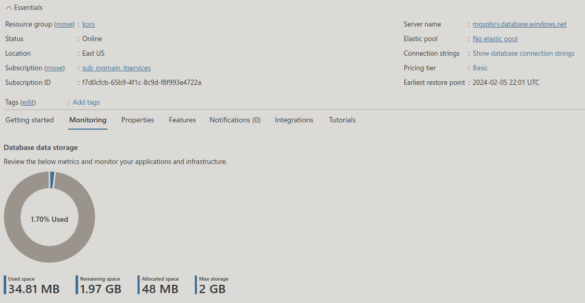
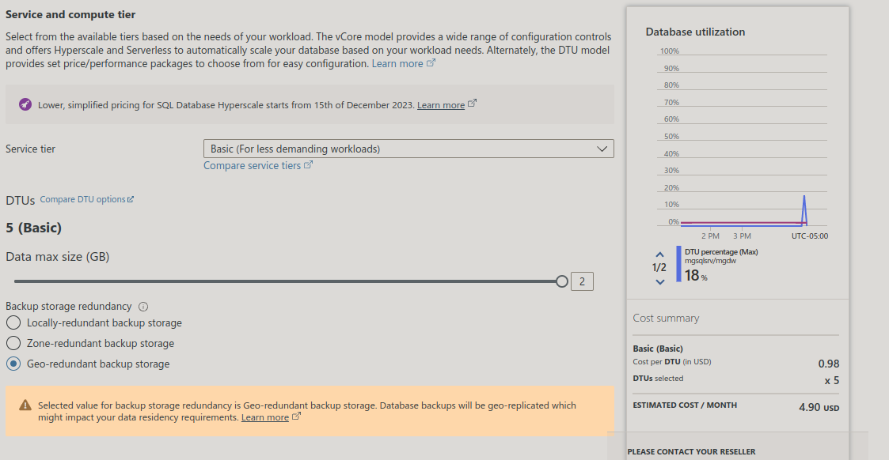
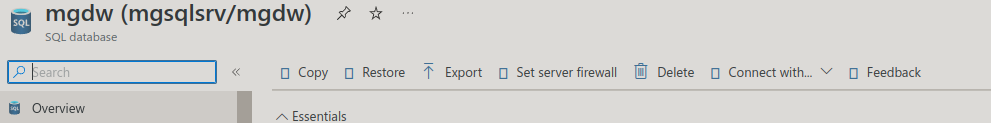

# mgdw (mgsqlsrv/mgdw)

SQL database

## resource id

```bash
/subscriptions/f7d0cfcb-65b9-4f1c-8c9d-f8f993e4722a/resourceGroups/kors/providers/Microsoft.Sql/servers/mgsqlsrv/databases/mgdw
```

```json
{
    "sku": {
        "name": "Basic",
        "tier": "Basic",
        "capacity": 5
    },
    "kind": "v12.0,user",
    "properties": {
        "collation": "SQL_Latin1_General_CP1_CI_AS",
        "maxSizeBytes": 2147483648,
        "status": "Online",
        "databaseId": "c308a1e6-28c3-44fd-a2f6-2a5ec4515519",
        "creationDate": "2021-08-31T18:12:58.19Z",
        "currentServiceObjectiveName": "Basic",
        "requestedServiceObjectiveName": "Basic",
        "defaultSecondaryLocation": "westus",
        "catalogCollation": "SQL_Latin1_General_CP1_CI_AS",
        "zoneRedundant": false,
        "earliestRestoreDate": "2024-02-05T21:56:53.8420801Z",
        "readScale": "Disabled",
        "currentSku": {
            "name": "Basic",
            "tier": "Basic",
            "capacity": 5
        },
        "currentBackupStorageRedundancy": "Geo",
        "requestedBackupStorageRedundancy": "Geo",
        "maintenanceConfigurationId": "/subscriptions/f7d0cfcb-65b9-4f1c-8c9d-f8f993e4722a/providers/Microsoft.Maintenance/publicMaintenanceConfigurations/SQL_Default",
        "isLedgerOn": false,
        "isInfraEncryptionEnabled": false,
        "availabilityZone": "NoPreference"
    },
    "location": "eastus",
    "tags": {},
    "id": "/subscriptions/f7d0cfcb-65b9-4f1c-8c9d-f8f993e4722a/resourceGroups/kors/providers/Microsoft.Sql/servers/mgsqlsrv/databases/mgdw",
    "name": "mgdw",
    "type": "Microsoft.Sql/servers/databases"
}
```



## cost



## **[set firewall](https://www.sqlshack.com/configure-ip-firewall-rules-for-azure-sql-databases/)**

go to Azure SQL server's dashboard and click "Set server firewall"



Set up server-level firewall rules using T-SQL
You can execute the stored procedure sp_set_firewall_rule in the Azure SQL Server master database. For example, the following T-SQL configures server-level rule named – Allow DB Connections for the IP address 10.0.0.2

 ```sql
  -- Enable Azure connections.  
  exec sp_set_firewall_rule N'Allow DB Connections', '10.0.0.2', '10.0.0.2';
  SELECT * FROM sys.firewall_rules
```
